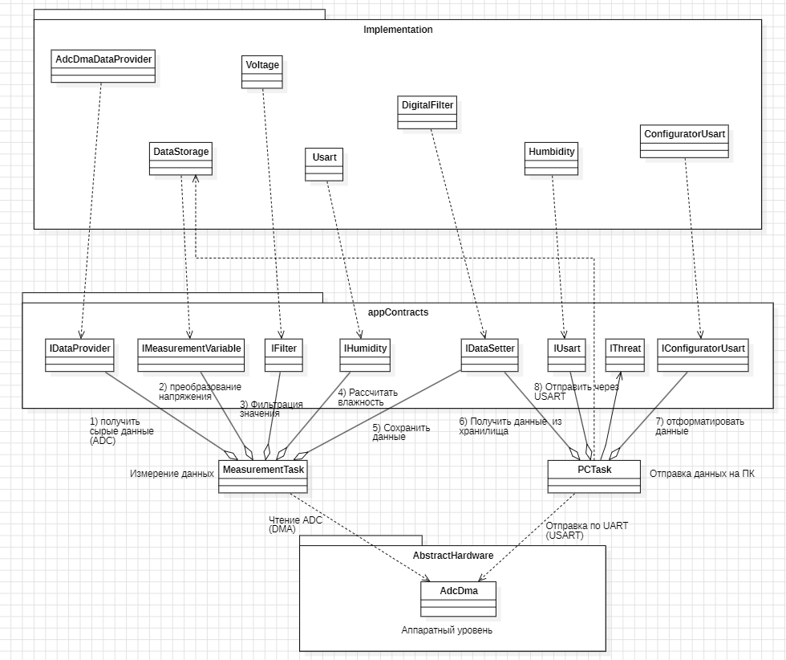
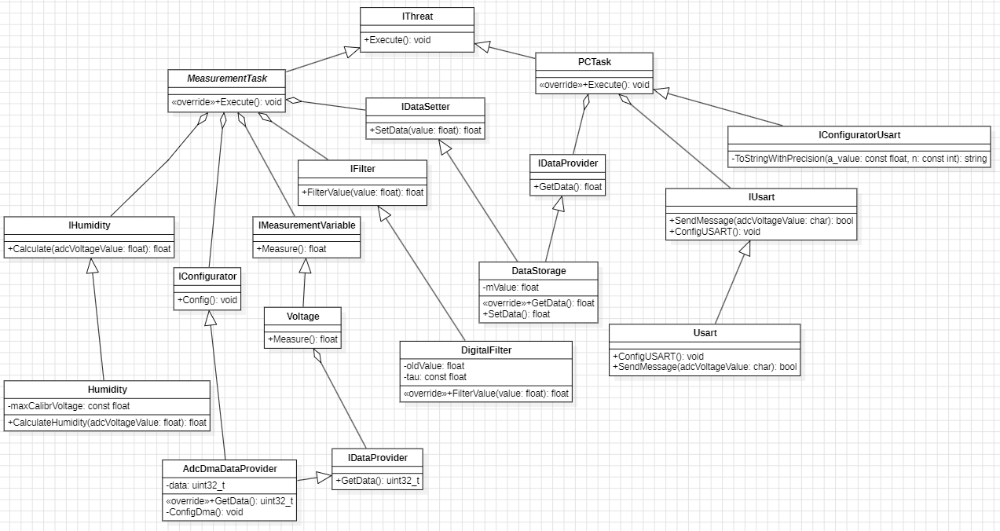

:toc: 
:toc-title: ОГЛАВЛЕНИЕ
:stem:
:stem: latexmath
:toclevels: 2
:figure-caption: Рисунок
:table-caption: Таблица 

== Архитектура ПО

=== Общая архитектура ПО

.Общая архитектура ПО

Эта система представляет собой программное обеспечение для сбора и анализа данных. В её основе лежат несколько основных компонентов, которые взаимодействуют через специальные интерфейсы.

Программное обеспечение устройства построено по модульному принципу и разделено на несколько логических уровней. Такой подход обеспечивает независимость прикладной логики от аппаратной части, упрощает тестирование отдельных компонентов и позволяет модифицировать систему без изменения основной архитектуры.

Архитектура состоит из трёх основных уровней:

* уровень аппаратного взаимодействия (AbstractHardware);
* уровень интерфейсов (appContracts);
* уровень реализации (Implementation).

==== Уровень аппаратного взаимодействия (AbstractHardware)
Нижний уровень архитектуры отвечает за непосредственную работу с периферийными модулями микроконтроллера STM32F411.

На данном уровне располагается модуль `AdcDma`, реализующий:

* настройку встроенного АЦП;
* организацию непрерывного измерения;
* передачу данных через DMA;
* взаимодействие с регистрами микроконтроллера.

Модуль скрывает аппаратные особенности STM32 и предоставляет прикладному уровню готовые данные измерений через абстрактные интерфейсы.

Использование отдельного аппаратного уровня позволяет изолировать код работы с регистрами микроконтроллера от бизнес-логики приложения.

==== Уровень интерфейсов (appContracts)
Уровень `appContracts` содержит набор абстрактных интерфейсов, определяющих взаимодействие между компонентами системы.

На данном уровне отсутствует конкретная реализация алгоритмов. Интерфейсы описывают только контракт взаимодействия между модулями.

В архитектуре используются следующие интерфейсы:

.Интерфейсы в архитектуре

[cols="1,3", options="header"]
|===
| Интерфейс | Назначение
| `IDataProvider` | Получение сырых данных измерений с АЦП
| `IMeasurementVariable` | Преобразование кодов АЦП в физические величины
| `IFilter` | Интерфейс цифровой фильтрации измерений
| `IHumidity` | Вычисление влажности почвы
| `IDataSetter` | Сохранение результатов измерений
| `IUsart` | Передача данных через интерфейс USART2
| `IThread` | Абстракция задачи операционной системы FreeRTOS
| `IConfiguratorUsart` | Форматирование строки перед передачей
|===

Использование интерфейсов позволяет:

* уменьшить связанность компонентов;
* упростить замену отдельных модулей;
* обеспечить расширяемость программного обеспечения;
* реализовать принципы объектно-ориентированного проектирования.

==== Уровень реализации (Implementation)
На уровне `Implementation` располагаются конкретные реализации интерфейсов прикладного уровня.

.Основные компоненты

[cols="1,3", options="header"]
|===
| Компонент | Назначение
| `AdcDmaDataProvider` | Получение данных АЦП через DMA
| `Voltage` | Преобразование кодов АЦП в напряжение
| `DigitalFilter` | Реализация экспоненциального цифрового фильтра
| `Humidity` | Расчёт влажности почвы по калибровочной формуле
| `DataStorage` | Хранение результатов измерений
| `Usart` | Передача данных через USART2
| `ConfiguratorUsart` | Формирование строки для передачи по Bluetooth
|===

Каждый компонент реализует соответствующий интерфейс из уровня `appContracts`.

==== Задача MeasurementTask
Задача `MeasurementTask` отвечает за полный цикл обработки измерений влажности почвы.

**Последовательность работы задачи:**

. Получение сырых данных АЦП через `IDataProvider`.
. Преобразование данных в напряжение.
. Фильтрация измеренного значения.
. Вычисление влажности почвы.
. Сохранение результата в хранилище данных.

Задача выполняется периодически с интервалом 100 мс в соответствии с требованиями технического задания.

==== Задача PCTask
Задача `PCTask` отвечает за передачу информации на внешнее устройство через Bluetooth-модуль HC-06.

**Основные функции задачи:**

* получение актуальных данных из хранилища;
* форматирование строки вида:

[source,text]
Влажность почвы: XXX.XX %

* передача строки через USART2.

Передача выполняется с использованием интерфейса `IUsart`.

==== Принцип взаимодействия компонентов
Работа системы начинается с непрерывного измерения аналогового сигнала датчика влажности встроенным АЦП микроконтроллера STM32F411. Полученные данные автоматически передаются в память с помощью DMA.

Задача `MeasurementTask` периодически получает последнее измеренное значение, выполняет его обработку и сохраняет рассчитанную влажность в хранилище данных.

Задача `PCTask` независимо от измерительного контура считывает подготовленные данные, преобразует их в текстовый формат и передаёт через Bluetooth-модуль HC-06 на ПК или мобильное устройство.

Таким образом, архитектура программного обеспечения обеспечивает:

* разделение ответственности между модулями;
* независимость прикладной логики от аппаратной платформы;
* возможность расширения функциональности;
* поддержку многозадачности средствами FreeRTOS;
* стабильную обработку и передачу данных в реальном времени.

=== UML-диаграмма

.UML-диаграмма 

==== Диаграмма классов системы измерения с DMA
// Анализ UML-диаграммы

==== Общее описание
Данная система реализует измерение аналогового сигнала с помощью АЦП и DMA,
его цифровую фильтрацию и передачу по USART.
Архитектура построена на интерфейсах, что позволяет легко подменять реализации.

.Интерфейсы (абстрактные контракты)

[cols="1,2"]
|===
| Интерфейс | Назначение

| `IMeasurementTask`
| Задача измерения. Метод `+Execute(): void+`. Паттерн «Команда».
  `<override>` - реализация переопределит метод.

| `IDataSetter`
| Установка данных. Метод `+SetData(value: float): float+`.
  Принимает float, возвращает float.

| `IFilter`
| Цифровой фильтр. Метод `+FilterValue(value: float): float+`.
  На вход значение, на выход отфильтрованное.

| `IUsart`
| Работа с USART:
  * `+SendMessage(adcVoltageValue: char): bool+` - отправка строки.
    На деле `char*` (указатель на строку).
  * `+ConfigUSART(): void+` - настройка USART.

| `IDataProvider`
| Источник данных. Метод `+GetData(): uint32_t+`.
  Возвращает «сырые» данные.
|===

=== Классы-реализации

==== AdcDmaDataProvider
* `-data: uint32_t` - поле хранения отсчёта АЦП (12 бит в uint32_t).
  **Сюда DMA положил данные из регистра ADC->DR.**
* `<override>+GetData(): uint32_t` - возвращает данные.
* `-ConfigDma(): void` - приватная настройка DMA
  (поток, канал, адреса, режим).

==== Voltage
* `+Measure(): float` - пересчёт отсчёта АЦП в вольты.
  Формула: `V = (ADC_value / 4095) * Vref`.
  * `4095` - максимум 12-битного АЦП.
  * `Vref` - опорное напряжение (обычно 3.3 В).

==== DigitalFilter
Реализует `IFilter`.
* `-oldValue: float` - предыдущее отфильтрованное значение.
* `-tau: const float` - константа времени фильтра (степень сглаживания).
  Чем больше `tau`, тем сильнее сглаживание.
* `<override>+FilterValue(value: float): float` - экспоненциальное сглаживание
  (фильтр низких частот первого порядка).

==== DataStorage
Реализует `IDataSetter`.
* `-mVvalue: float` - текущее значение в милливольтах.
* `<override>+GetData(): float` - возвращает `mVvalue`.
* `+SetData(): float` - записывает и возвращает новое значение.

==== Configurator
* `+Config(): void` - единая точка конфигурации. Внутри вызывает:
  ** `AdcDmaDataProvider::ConfigDma()`
  ** `Usart::ConfigUSART()`
  ** настройку пинов и тактирования.

==== Usart
Реализует `IUsart`.
* `+ConfigUSART(): void` - настройка скорости, стоп-битов, ножек TX/RX.
* `+SendMessage(adcVoltageValue: char): bool` - отправка строки
  (указатель на массив символов). Возвращает `true` при успехе.

==== PCTask
Реализует `IMeasurementTask`.
* `<override>+Execute(): void` - главный измерительный цикл.
+
Алгоритм внутри:
.. `AdcDmaDataProvider::GetData()` - сырые данные АЦП
.. `Voltage::Measure()` - перевод в вольты
.. `DigitalFilter::FilterValue()` - фильтрация
.. `DataStorage::SetData()` - сохранение
.. `Usart::SendMessage()` - передача по USART

==== Humidity
* `-maxCalibrVoltage: const float` - калибровочная константа датчика влажности.
* `+CalculateHumidity(adcVoltageValue: float): float` - пересчёт напряжения
  в относительную влажность (RH%).

==== IConfiguratorUsart
* `-ToStringWithPrecision(a_value: const float, n: const int): string` -
  приватный метод форматирования.
  Преобразует `float` в строку с `n` знаками после запятой.

=== Поток данных (Data Flow)
[source,text]
----
АЦП → DMA → AdcDmaDataProvider.GetData()
                      ↓
               Voltage.Measure()
                      ↓
           DigitalFilter.FilterValue()
                      ↓
             DataStorage.SetData()
                      ↓
              Usart.SendMessage()
----

==== Где DMA встречается с кодом

Единственная точка контакта DMA с прикладным кодом -
класс `AdcDmaDataProvider`. Именно в нём:
* `ConfigDma()` настраивает контроллер DMA (поток, канал, режим).
* Поле `data` хранит результат, аппаратно помещённый туда DMA.
* `GetData()` возвращает эти данные вышестоящему коду (`PCTask`).

== Примечания
* `ADC_value` - целочисленное значение из регистра `ADC->DR`.
  DMA помещает его в `AdcDmaDataProvider::data`.
* `tau` - безразмерная константа. При `tau = 1` фильтр отключён
  (выход = вход). При `tau = 10` сильное сглаживание.
* `SendMessage` принимает `char`, но логически это `const char*` -
  указатель на строку, сформированную `ToStringWithPrecision`.
