:toc: 
:toc-title: ОГЛАВЛЕНИЕ
:stem:
:stem: latexmath
:toclevels: 2
:figure-caption: Рисунок
:table-caption: Таблица 

== Эксперементальная часть

Мы провели калибровку и получили следующие значения сырого кода АЦП:

* 1412 для 60%;
* 933 для 40%;
* 467 для 20%;
* 2 для 0%.

Далее будут показаны видео, как происходили все эксперементы по отпределению корректности работы датчика влажности.

В первом видио показано, как мы высушивали землю.

video::1.mp4[]

Далее мы измерили влажность в полностью сухой почве, где предполагалась влажность 0%

video::2.mp4[]

Следующий шаг заключается в том, что мы добавляем 20 г воды в землю, чтобы добиться результата 20% влажности почвы. Вы можете увидеть это на следующих двух видео.

video::3.mp4[]

video::4.mp4[]

Далее добиваемся того, чтобы почва имела влажность 40% и проверяем это.

video::5.mp4[]

И также делаем для 60% и проверяем это.

video::6.mp4[]

== Программирование 

=== Структура программы

Архитектура программного обеспечения построена на принципах объектно-ориентированного проектирования с использованием интерфейсов для обеспечения гибкости и модульности. Ниже приведено описание основных классов и их взаимодействия.

==== Интерфейсы

*Интерфейс IThread*

.Интерфейс IThread
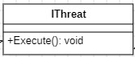

Базовый интерфейс для всех задач реального времени.

Метод void Execute():: 
Абстрактный метод, содержащий основной цикл задачи. Переопределяется в классах-наследниках.

*Интерфейс IDataSetter*

.Интерфейс IDataSetter
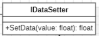

Интерфейс для установки данных в хранилище.

Метод float SetData(float value):: 
Сохраняет переданное значение. Возвращает сохранённое значение.

*Интерфейс IDataProvider*

.Интерфейс IDataProvider
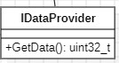

Интерфейс для получения сырых данных с АЦП.

Метод uint32_t GetData():: 
Возвращает сырой код АЦП (значение от 0 до 4095).

*Интерфейс IDataProviders*

.Интерфейс IDataProvider

Интерфейс для получения обработанных данных из хранилища.

Метод float GetData() const:: 
Возвращает последнее сохранённое значение влажности в процентах.

*Интерфейс IFilter*

.Интерфейс IFilter
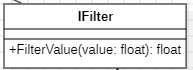

Шаблонный интерфейс цифрового фильтра.

Метод float FilterValue:: 
Принимает входное значение, возвращает отфильтрованное значение. Параметр `float` определяет тип обрабатываемых данных.

*Интерфейс IFormatterUSART*

.Интерфейс IFormatterUSART
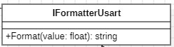

Интерфейс для форматирования числовых данных в строку перед отправкой через USART.

Метод std::string Format(float value):: 
Преобразует переданное число в строку с заданным форматом. Возвращает строку, готовую для отправки через последовательный порт.

*Интерфейс IHumidity*

.Интерфейс IHumidity
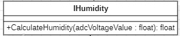

Интерфейс для расчёта влажности.

Метод float CalculateHumidity(float adcVoltageValue):: 
Рассчитывает влажность на основе переданного напряжения.  
* `adcVoltageValue` — напряжение с датчика (от 0 до 3.3 В).  
Возвращает влажность в процентах (от 0 до 100).

*Интерфейс IMeasurementVariable*

.Интерфейс IMeasurementVariable
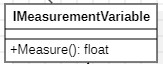

Интерфейс для измерения физической величины.

Метод float Measure():: 
Выполняет измерение и возвращает результат. В проекте используется для преобразования кода АЦП в напряжение.

*Интерфейс IUsart*

.Интерфейс IUsart
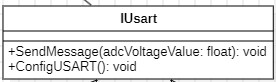

Интерфейс для работы с последовательным портом.

Метод void ConfigUSART():: 
Настраивает USART2 на скорость 9600 бод, формат 8N1.

Метод void SendMessage(float adcVoltageValue):: 
Форматирует и отправляет сообщение с влажностью через Bluetooth-модуль.  
* `adcVoltageValue` — значение влажности в процентах.

==== Классы, реализующие интерфейсы

*Класс AdcDmaDataProvider*

.Класс AdcDmaDataProvider
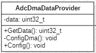

Реализует интерфейсы `IDataProvider`. Обеспечивает получение данных с АЦП через механизм прямого доступа к памяти (DMA).

Конструктор AdcDmaDataProvider():: 
Инициализирует поле `data` нулевым значением и вызывает метод `Config()` для автоматической настройки АЦП и DMA при создании объекта. Таким образом, настройка происходит один раз при инициализации, и задача `MeasurementTask` не должна вызывать `Config()` самостоятельно.

Метод void Config():: 
Настраивает АЦП и DMA. Выполняет конфигурацию регистров:
- АЦП: разрешение 12 бит, непрерывный режим, включение DMA.
- DMA: круговой режим, направление «периферия → память», размер слова 32 бита.
После настройки запускает АЦП. Вызывается автоматически из конструктора.

Метод uint32_t GetData():: 
Возвращает последнее значение кода АЦП из поля `data`, которое автоматически обновляется через DMA.

Приватный метод void ConfigDma():: 
Настраивает регистры DMA2 (канал 0, поток 0): адрес источника (регистр АЦП), адрес приёмника (`&data`), количество передач (1).

*Класс DataStorage*

.Класс DataStorage
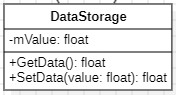

Реализует интерфейсы `IDataProviders` и `IDataSetter`. Служит общим хранилищем данных для обмена между задачами.

Конструктор DataStorage():: 
Инициализирует хранилище.

Метод float GetData() const:: 
Возвращает значение из приватного поля `mValue`.

Метод float SetData(float value):: 
Сохраняет переданное значение в поле `mValue` и возвращает его.

Поле float mValue:: 
Хранит текущее отфильтрованное значение влажности в процентах.

*Класс Humidity*

.Класс Humidity
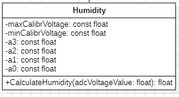

Реализует интерфейс `IHumidity`. Преобразует напряжение с датчика в проценты влажности с помощью полинома третьей степени.

Конструктор Humidity():: 
Инициализирует коэффициенты полинома и калибровочные напряжения.

Метод float CalculateHumidity(float adcVoltageValue):: 
Вычисляет влажность. 

Если результат превышает 100%, ограничивает его 100%.

Константные поля::
* `maxCalibrVoltage = 1.894f` — максимальное калибровочное напряжение.
* `minCalibrVoltage = 0.0f` — минимальное калибровочное напряжение.
* `a3 = -2.213f`, `a2 = 5.353f`, `a1 = 49.275f`, `a0 = 0.011f` — коэффициенты полинома.

*Класс Usart*

.Класс Usart
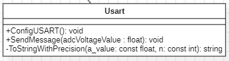

Реализует интерфейс `IUsart`. Обеспечивает настройку последовательного порта и отправку данных на Bluetooth-модуль HC-06.

Конструктор Usart():: 
Инициализирует объект.

Метод void ConfigUSART():: 
Настраивает выводы PA2 (TX) и PA3 (RX) в режим альтернативной функции AF7 (USART2). Устанавливает скорость 9600 бод, формат 8 бит данных, 1 стоп-бит, без контроля чётности. Включает тактирование USART2.

Метод void SendMessage(float adcVoltageValue):: 
Формирует строку вида `"Humidity: XX.XX %\r\n"` и отправляет её побайтно через USART2. Перед отправкой каждого байта проверяет готовность буфера передатчика.

Приватный метод std::string ToStringWithPrecision(const float a_value, const int n = 2):: 
Преобразует число с плавающей точкой в строку с заданной точностью (по умолчанию 2 знака после запятой).

*Класс MeasurementTask*

.Класс MeasurementTask
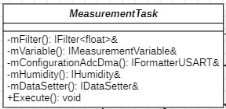

Наследуется от `OsWrapper::Thread<512>`. Главная задача, выполняющая измерение влажности с периодом 100 мс.

Конструктор MeasurementTask(IFilter<float>& filter, IMeasurementVariable& variable, IFormatterUSART& configurationAdcDma, IHumidity& humidity, IDataSetter& dataSetter):: 
Инициализирует поля класса:
* `mFilter` — ссылка на фильтр.
* `mVariable` — ссылка на объект измерения напряжения.
* `mConfigurationAdcDma` — ссылка на конфигуратор АЦП/DMA.
* `mHumidity` — ссылка на объект расчёта влажности.
* `mDataSetter` — ссылка на хранилище данных.

Метод void Execute() override:: 
Основной цикл задачи. Последовательно выполняет:

. Бесконечный цикл:
.. Измерение напряжения через `mVariable.Measure()`.
.. Фильтрацию значения через `mFilter.FilterValue()`.
.. Расчёт влажности через `mHumidity.CalculateHumidity()`.
.. Сохранение результата через `mDataSetter.SetData()`.
.. Ожидание 100 мс через `Sleep(100ms)`.

Примечание: настройка АЦП и DMA происходит автоматически в конструкторе `AdcDmaDataProvider` при создании объекта, поэтому в теле задачи этот вызов отсутствует.

*Класс BluetoothTask*

.Класс BluetoothTask
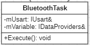

Наследуется от `OsWrapper::Thread<512>`. Задача отправки данных через Bluetooth с периодом 1 секунда.

Конструктор BluetoothTask(IDataProviders& variable, IUsart& usart):: 
Инициализирует поля класса:
* `mVariable` — ссылка на хранилище данных.
* `mUsart` — ссылка на объект USART.

Метод void Execute() override:: 
Основной цикл задачи:
. Настройка USART через `mUsart.ConfigUSART()`.
. Бесконечный цикл:
.. Получение данных из хранилища через `mVariable.GetData()`.
.. Отправка данных через `mUsart.SendMessage()`.
.. Ожидание 1 секунды через `SleepUntil(1000ms)`.

*Класс PCTask*

.Класс PCTask
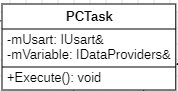

Наследуется от `OsWrapper::Thread<512>`. Задача отправки данных на компьютер для отладки (через USB). Работает аналогично `BluetoothTask`.

Конструктор PCTask(IDataProviders& variable, IUsart& usart):: 
Инициализирует поля класса:
* `mVariable` — ссылка на хранилище данных.
* `mUsart` — ссылка на объект USART.

Метод void Execute() override:: 
Основной цикл задачи. Логически идентичен `BluetoothTask.Execute()`, но использует другой экземпляр USART (для отладки).

*Класс DigitalFilter*

.Класс DigitalFilter
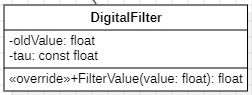

Реализует интерфейс `IFilter`. Экспоненциальный фильтр первого порядка для сглаживания шумов.

Конструктор DigitalFilter():: 
Вычисляет коэффициент сглаживания `tau`

Метод float FilterValue(float value) override:: 
При первом вызове сохраняет входное значение как `oldValue` и возвращает его без изменений. При последующих вызовах вычисляет фильтрованное значение.

Обновляет `oldValue` и возвращает отфильтрованное значение.

Приватные поля::
* `oldValue` — предыдущее отфильтрованное значение.
* `tau` — константный коэффициент сглаживания.

*Класс Voltage*

.Класс Voltage
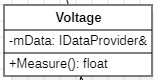

Реализует интерфейс `IMeasurementVariable`. Преобразует код АЦП в напряжение.

Конструктор Voltage(IDataProvider& data):: 
Инициализирует ссылку на источник данных (объект `AdcDmaDataProvider`).

Метод float Measure() override:: 
Запрашивает сырой код через `mData.GetData()` и преобразует его в напряжение.

Приватное поле::
* `mData` — ссылка на объект, реализующий `IDataProvider`.

*Класс FormatterUSART*

.Класс FormatterUSART
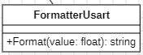

Реализует интерфейс `IFormatterUSART`. Отвечает за преобразование значения влажности в строку определённого формата.

Метод std::string Format(float value) override:: 
Форматирует значение влажности в строку по шаблону:
+
[source, text]
----
Humidity: XX.XX %\r\n
----
+
где `XX.XX` — значение влажности с двумя знаками после запятой.
+
* `std::fixed` — вывод числа в формате с фиксированной запятой (не в научной нотации).
* `std::setprecision(2)` — два знака после запятой.
* `\r\n` — символы возврата каретки и перевода строки (необходимы для корректного отображения в терминальных программах).

Для удобства в создании кода была сделана UML-диаграмма для нашей программы.

.UML-диаграмма 
image::10.jpg[]

== Заключение

В результате выполнения курсовой работы разработано и реализовано устройство измерения влажности почвы на базе микроконтроллера STM32F411. Устройство работает в соответствии с техническим заданием: измерение выполняется каждые 100 мс, значения фильтруются и передаются по Bluetooth.

=== Достигнутые результаты

Разработанная архитектура на основе интерфейсов обеспечила гибкость и модульность кода. Использование FreeRTOS позволило разделить задачи измерения и передачи данных, которые работают независимо с периодами 100 мс и 1 с.

Применение цифрового фильтра решило проблему высокочастотных шумов датчика: сырые значения прыгали от 20% до 50% при неизменной влажности, после фильтрации показания стали плавными и достоверными.

=== Калибровка

Калибровка выполнена термостатно-весовым методом на одном образце почвы с последовательным добавлением воды: 0 г → 0%, 20 г → 20%, 40 г → 40%, 60 г → 60%. Получены коды АЦП: 2, 467, 933, 1412. Эксперимент подтвердил корректность полиномиальной аппроксимации: в сухой почве датчик показывает 0-5%, в воде - около 100%.

=== Итог

Устройство полностью работоспособно и соответствует техническому заданию. В ходе работы получен практический опыт проектирования встраиваемых систем, работы с АЦП, DMA, FreeRTOS, а также проведения физических измерений и оформления технической документации.
