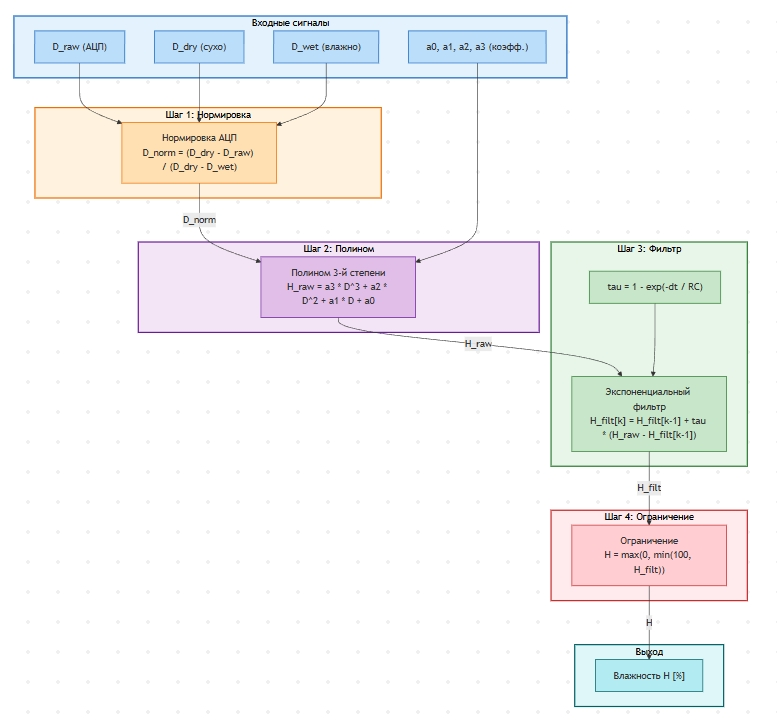

:toc: 
:toc-title: ОГЛАВЛЕНИЕ
:stem:
:stem: latexmath
:toclevels: 2
:figure-caption: Рисунок
:table-caption: Таблица 

[.text-center]
Южно-Уральский государственный университет (НИУ)
Высшая школа электроники и компьютерных наук
Кафедра «Информационно-измерительная техника»

[.text-right]
УТВЕРЖДАЮ +
Заведующий кафедрой +
&#95;&#95;&#95;&#95;&#95;&#95;&#95;&#95;&#95;&#95; (М.Н. Самодурова) +
&#95;&#95;&#95;&#95;&#95;&#95;&#95;&#95;&#95;&#95;&#95;&#95;&#95;&#95;&#95; 2026 г.

[.text-center]
*ЗАДАНИЕ НА РАБОТУ* +
на курсовую работу студенту: +
Володиной Екатерине Алексеевне +
группа: КЭ-413

{nbsp} +
{nbsp} +
{nbsp} +

[.text-left]
. *Дисциплина:* *_Программное обеспечение измерительных процессов._*
. *Тема работы:* *_Разработка устройства измерения влажности почвы_*
. *Требования к разработке:*
* Для разработки должна использоваться отладочная плата https://www.waveshare.com/product/arduino-2/boards-kits/nucleo/xnucleo-f411re.htm[XNUCLEO-F411RE]
* Питание платы должно быть автономным и подаваться с солнечный батарей
* Устройство должно измерять влажность почвы
** Для измерения должен использоваться встроенный АЦП микроконтроллера STM32F411
** Период измерения должен быть 100 ms
** Для получения кодов АЦП  должен использоваться механизм DMA
** Для изменения влажности должен использоваться датчик влажности почвы https://www.waveshare.com/product/Moisture-Sensor.htm[Moisture Sensor]
** Погрешность измерения влажности почвы не должна превышать 5% в диапазоне от 0 до 60%
** К измеренному значению должен быть применен цифровой фильтр вида: +
latexmath:[\tau = \begin{cases} 
               \left(1 - e^{-\frac{dt}{R \cdot C}}\right), & \text{если } R \cdot C > 0 \text{ сек} \\
              1, & \text{если } R \cdot C \leq 0 \text{ сек}
           \end{cases}]
 
\$"FilteredValue" = "OldFiltered" + ("Value" - "OldValue") * tau\$,

где dt -  100 мс; +
Value – текущее нефильтрованное измеренное значение влажности; +
oldValue -  предыдущее фильтрованное значение.

* Передача значений по беспроводному интерфейсу должна осуществляться через модуль https://elecfreaks.com/estore/download/EF03073-Bluetooth_Bee_(HC-05_and_HC-06)User_Guide.pdf[BlueTooth Bee HC-06]
или https://www.waveshare.com/product/arduino-2/shields/others/io-expansion-shield.htm[I/O Expansion Shield]
** Общение с платой расширения должно осуществляться через USART2
** формат вывод: +
   "Влажность почвы: " XXX.XX [Units]
* Архитектура должна быть представлена в виде UML диаграмм в пакете Star UML
* Приложение должно быть написано на языке С++ с использование компилятора ARM 8.40.2
* При разработке должна использоваться Операционная Система Реального Времени FreeRTOS и https://github.com/lamer0k/RtosWrapper[С++ обертка над ней]

[start=4]

. *Перечень вопросов, подлежащих разработке:*
* В ходе работы необходимо разработать архитектуру программного обеспечения в виде диаграммы UML.
* В ходе работы необходимо разработать код программного обеспечения.
** Код должен соответствовать стандарту кодирования https://tproger.ru/translations/stanford-cpp-style-guide/[Стэнфордского университета], см также https://stanford.edu/class/archive/cs/cs106b/cs106b.1158/styleguide.shtml[оригинал]
* Работа программы должна быть продемонстрирована совместно с платой XNUCLEO-F411RE.
* Содержание работы должно соответствовать ГОСТ 19.402–78 «Единая система программной документации. Описание программы».
** работа должна быть оформлена в формате Asciidoc и выложена на Github
* Описание архитектуры в виде UML диаграмм должно быть оформлено в разделе «Описание логической структуры» -> “Алгоритм программы”.
* Дополнительно к архитектуре, в разделе «Описание логической структуры» -> “Структура программы с описанием функций составных частей и связи между ними” должен быть описан принцип работы программы и взаимодействия разных блоков программы друг с другом.
* Оформление пояснительной записки к курсовой работе в соответствии с СТО ЮУрГУ 04–2008 «Курсовое и дипломное проектирование. Общие требования к содержанию и оформлению».

. *Календарный план:*
* Сдача этапов выполнения курсовой работы осуществляется строго в соответствии с календарным планом.

[cols="4,3,2"]
|===
|Наименование разделов курсовой работы |Срок выполнения разделов работы |Отметка руководителя о выполнении

|Разработка общей архитектуры программы
|28 марта 2026 г.
|

|Разработка кода каркаса программы
|4 апреля 2026 г.
|

|Разработка детальной архитектуры модуля работы с датчиком
|11 апреля 2026 г.
|

|Разработка кода для модуля работы с датчиком
|11 апреля 2026 г.
|

|Разработка детальной архитектуры модуля работы с индикатором
|18 апреля 2026 г.
|

|Разработка кода для модуля работы с индикатором
|18 апреля 2026 г.
|

|Разработка детальной архитектуры модуля работы с USART и блутуз
|25 апреля 2026 г.
|

|Разработка кода для модуля работы  с USART и блутуз
|25 апреля 2026 г.
|

|Разработка детальной архитектуры и кода для оставшихся модулей
|2 мая 2026 г.
|

|Сдача и демонстрация работы устройства
|9 мая 2026 г.
|

|Оформление пояснительной записки к курсовой работе
|20 мая 2026 г.
|

|===

{nbsp} +
{nbsp} +

Руководитель работы:  &#160;&#160;&#160;&#160;&#160;&#160;&#160;&#160;&#160;&#160;&#160;&#160;&#160;&#160;&#160;&#160;&#160;&#160;&#160;&#95;&#95;&#95;&#95;&#95;&#95;&#95;&#95;&#95;&#95;&#95;&#95;&#95;&#95;&#95;&#95;&#95;&#95;&#95;&#95;&#95;&#95;&#95;&#95;&#95;&#95;&#95;&#95;&#95;&#95;&#95;&#95;&#95;&#95;&#95;&#95;&#95;&#95;&#95;&#95;&#95;/С. В. Колодий/ +
[.text-center]
(подпись) +

[.text-left]
Володина Е.А. &#160;&#160;&#160;&#160;&#160;&#160;&#160;&#160;&#160;&#160;&#160;&#160;&#160;&#160;&#160;&#160;&#160;&#160;&#160;&#160;&#160;&#160;&#160;&#160;&#160;&#160;&#160;&#160;&#160;&#160;&#160;&#160;&#160;&#160;&#160;&#160;&#160;&#160;&#160;&#160;&#160;&#160;&#160;&#160;&#160;&#160; &#95;&#95;&#95;&#95;&#95;&#95;&#95;&#95;&#95;&#95;&#95;&#95;&#95;&#95;&#95;&#95;&#95;&#95;&#95;&#95;&#95;&#95;&#95;&#95;&#95;&#95;&#95;&#95;&#95;&#95;&#95;&#95;&#95;&#95;&#95;&#95;&#95;&#95;&#95;&#95;&#95;/&#160;&#160;&#160;&#160;&#160;&#160;&#160;&#160;&#160;&#160;&#160;&#160;&#160;&#160;&#160;&#160;&#160;&#160;&#160;&#160;&#160;&#160; / +

[.text-center]
(подпись) +

<<<

== Требования к разработке

[options="header"]
|===
| Требование | Описание

| Используемая отладочная плата
| XNUCLEO-F411RE

| Источник питания
| Автономное питание от солнечной батареи

| Измеряемый параметр
| Влажность почвы

| Используемый АЦП
| Встроенный АЦП микроконтроллера STM32F411

| Период измерения
| 100 мс

| Механизм получения данных АЦП
| DMA (Direct Memory Access)

| Датчик влажности почвы
| Moisture Sensor

| Требования к точности
| Погрешность измерения не более 5% в диапазоне 0-60%

|===

* К измеренному значению должен быть применен цифровой фильтр вида:
latexmath:[\tau = \begin{cases} 
               \left(1 - e^{-\frac{dt}{R \cdot C}}\right), & \text{если } R \cdot C > 0 \text{ сек} \\
              1, & \text{если } R \cdot C \leq 0 \text{ сек}
           \end{cases}]
 
\$"FilteredValue" = "OldFiltered" + ("Value" - "OldValue") * tau\$,
 
где dt - 100 мс;

Value – текущее нефильтрованное измеренное значение влажности;

oldValue - предыдущее фильтрованное значение.

* **Беспроводная связь:** Модуль BlueTooth Bee HC-06 или I/O Expansion Shield.
* **Шина данных:** USART2.
* **Вывод в консоль/по каналу:** `"Влажность почвы: " XXX.XX [Units]`.
* **Документирование архитектуры:** UML диаграммы в StarUML.
* **Стек технологий:** Язык C++, компилятор ARM 8.40.2, ОСРВ FreeRTOS.
* **Обертка для ОС:** https://github.com/lamer0k/RtosWrapper[RtosWrapper] (C++).

<<<

== Анализ требований к разработке

Датчик необходим для измерения влажности почвы. Он генерирует электрическое напряжение, которое увеличивается с повышением уровня влажности. Микроконтроллер обрабатывает это напряжение, преобразует его в процентное значение, устраняет шумы и передаёт данные на телефон или компьютер через Bluetooth.

.Функциональная схема
image::4.png[]

На рисунке представлена структурная схема разрабатываемого устройства, отображающая состав аппаратных и программных компонентов системы, а также направления передачи данных между ними.

Блок «Питание» обеспечивает подачу электрической энергии на все элементы схемы.

Блок «Датчик влажности» формирует аналоговый сигнал, пропорциональный измеряемой влажности почвы, и передаёт его в микроконтроллер.

Центральным элементом схемы является блок «STM32F411», представляющий собой микроконтроллер, установленный на отладочной плате. Внутри микроконтроллера выделен программный компонент «USART2 Driver», отвечающий за управление последовательным интерфейсом.

От драйвера USART2 данные по проводному каналу UART направляются в блок «Bluetooth HC-06 или I/O Expansion Shield». Данный блок обеспечивает преобразование проводного интерфейса в беспроводной канал связи.

Завершающим элементом схемы является блок «ПК/смартфон», который принимает данные по беспроводному каналу для отображения и дальнейшего анализа.

=== Отладочная плата XNUCLEO-F411RE

XNUCLEO-F411RE - это отладочная плата от компании Waveshare, совместимая с Arduino. Она предназначена для изучения возможностей микроконтроллера STM32F411RET6, основанного на ядре Cortex-M3. Функциональные возможности платы легко расширяются благодаря поддержке Arduino шилдов. На плате предусмотрены разъемы, обеспечивающие полный доступ к линиям ввода/вывода микроконтроллера (I/O). Наличие поддержки mbed позволяет быстро создавать прототипы устройств с использованием SDK и онлайн-инструментов. В комплект поставки входит отдельный модуль ST-Link/V2.

.Отладочная плата XNUCLEO-F411RE
image::1.jpg[]

.Технические характеристики микроконтроллера STM32F411RET6
[cols="1,3", options="header"]
|===
| Параметр | Значение
| Ядро | ARM 32-бит Cortex-M4
| Рабочая частота | 100 МГц
| Рабочее напряжение | 1.7…3.6 В
| Память | 512 кБ Flash, 128 кБ SRAM
| Интерфейсы | 1 x SDIO, 1 x USB 2.0 FS, 5 x SPI или 5 x I2S, 3 x USART, 3 x I2C
| АЦП/ЦАП | 1 x АЦП (12 бит, 16 каналов)
|===

=== Датчик влажности

*Датчик влажности почвы (Moisture Sensor):*

* Система должна взаимодействовать с датчиком данного типа и корректно обрабатывать его выходные сигналы.

* Конструкция датчика выполнена в виде «вилки», что обеспечивает удобное погружение в почву.

* Принцип работы: выходное напряжение повышается с увеличением влажности.

* Область применения: автоматические системы полива и обнаружения влаги.

.Вид датчика влажности
image::2.jpg[]

.Технические характеристики датчика влажности почвы
[cols="1,2", options="header"]
|===
| Параметр | Значение
| Глубина обнаружения | 38 мм
| Напряжение питания | 2…5 В
| Монтажные отверстия | 2 мм
| Габаритные размеры | 20 × 51 мм
|===

.Схема подключения датчика влажности
image::3.jpg[]

[cols="1,1,2", options="header"]
|===
| Датчик влаги | Pico | Описание

| VCC          | 3.3V  | Вход питания
| GND          | GND   | Земля (общий провод)
| AOUT         | PB1   | Аналоговый выход данных
|===

Датчик влажности имеет аналоговый выход, поэтому нужно выбрать пин с поддержкой АЦП, т.е. PB1.

=== АЦП

*Назначение:* АЦП используется для преобразования напряжения, поступающего с датчика влажности почвы, в цифровой код для последующей обработки микроконтроллером.

*Реализация на STM32F411:*

* Микроконтроллер оснащён *многоканальным 12-битным АЦП*.
* Аналоговый сигнал конвертируется в цифровое значение.
* Для работы необходимо настроить АЦП с указанием используемых каналов и соответствующих пинов.

*Характеристики АЦП:*

* Разрешение: *12 бит*
* Диапазон входного напряжения: *0…3.3 В*
* Диапазон выходных цифровых значений: *0…4095*

.Настройка регистров для АЦП STM32F411
|===
| Этап | Регистр | Поле (биты) | Значение | Назначение

| Тактирование GPIO | RCC_AHB1ENR | GPIOBEN (0) | 1 | Включить тактирование порта B
| Настройка пина | GPIOB_MODER | MODER0 (1:0) | 11 | Установить PB1 в режим аналогового входа
|  | GPIOA_PUPDR | PUPDR0 (1:0) | 00 | Отключить подтягивающие резисторы

| Тактирование АЦП | RCC_APB2ENR | ADC1EN (8) | 1 | Включить тактирование для ADC1
| Тактирование DMA | RCC_AHB1ENR | DMA2EN (22) | 1 | Включить тактирование контроллера DMA2

| Настройка разрешения АЦП | ADC_CR1 | RES (25:24) | 00 | Установить разрешение 12 бит

| Настройка режима | ADC_CR2 | EOCS (10) | 1 | Флаг окончания преобразования ставится после каждого канала
|  | ADC_CR2 | CONT (1) | 1 | Режим непрерывного преобразования

| Время выборки | ADC_SMPR2 | SMP0 (2:0) | 111 | Установить 480 такта выборки 
|===

==== Описание настройки регистров АЦП

Представленная таблица отражает последовательность конфигурации регистров для организации аналого-цифрового преобразования сигнала с датчика влажности. Настройка выполняется в несколько логических этапов.

*1. Тактирование и настройка порта ввода-вывода*

На первом этапе включается тактирование порта B установкой бита `GPIOBEN` в регистре `RCC_AHB1ENR`. Это необходимо для подачи тактового сигнала на периферийный модуль GPIOB, к которому подключён аналоговый датчик.

В регистре `GPIOB_MODER` для пина PB0 (биты `MODER0[1:0]`) устанавливается значение `11`, что переводит вывод в режим аналогового входа. В регистре `GPIOA_PUPDR` для этого же пина биты `PUPDR0[1:0]` устанавливаются в `00`, отключая как подтяжку вверх, так и подтяжку вниз. Это необходимо для исключения влияния внутренних резисторов на измеряемый аналоговый сигнал и обеспечения максимальной точности оцифровки.

*2. Тактирование АЦП и DMA*

Для работы АЦП необходимо включить его тактирование. В регистре `RCC_APB2ENR` устанавливается бит `ADC1EN` (бит 8), подающий тактовый сигнал на модуль ADC1. Одновременно в регистре `RCC_AHB1ENR` устанавливается бит `DMA2EN` (бит 22), включающий тактирование контроллера DMA2, который будет использоваться для автоматической пересылки результатов преобразования в память.

*3. Настройка разрешения АЦП*

В регистре `ADC_CR1` биты `RES[25:24]` устанавливаются в `00`, что соответствует разрешению 12 бит. Это максимальное разрешение для данного АЦП, обеспечивающее 4096 градаций входного сигнала и наилучшую точность измерения.

*4. Настройка режима работы*

В регистре `ADC_CR2` конфигурируются следующие параметры:
* Бит `EOCS` (бит 10) устанавливается в `1`, что предписывает устанавливать флаг окончания преобразования после каждого измеренного канала, а не после всей последовательности.
* Бит `CONT` (бит 1) устанавливается в `1`, переводя АЦП в режим непрерывного преобразования. В этом режиме после завершения одного измерения автоматически начинается следующее, что в сочетании с DMA обеспечивает непрерывный поток данных с заданным периодом.

*5. Настройка времени выборки*

В регистре `ADC_SMPR2` для канала 0 (к которому подключён PB0) биты `SMP0[2:0]` устанавливаются в значение `111`, что соответствует времени выборки 480 тактов. Выбор максимального времени выборки обусловлен высоким выходным сопротивлением датчика влажности почвы: более длительная выборка позволяет внутреннему конденсатору АЦП полностью зарядиться до уровня входного сигнала, минимизируя погрешность измерения. При периоде опроса 100 мс данная настройка не влияет на общую производительность системы.

Если время выборки слишком мало, конденсатор выборки-хранения не успевает зарядиться до реального напряжения датчика. При высоком выходном сопротивлении датчика (особенно в сухой почве) требуется больше времени для заряда.

Значение 480 тактов является максимальным в STM32F411. Оно гарантирует точность 12 бит для любого источника сигнала с сопротивлением до нескольких сотен килоом. При частоте АЦП 30 МГц это даёт время выборки около 16 мкс, что составляет лишь 0,016% от периода измерения 100 мс. Таким образом, выбор максимального времени выборки не снижает производительность, но обеспечивает максимальную точность и надёжность измерений.

=== Прямой доступ к памяти (DMA)

==== Обоснование использования DMA

DMA (Direct Memory Access) позволяет передавать данные из АЦП в память без участия процессора. Благодаря этому процессор может параллельно выполнять другие задачи.

*Альтернатива без DMA:* Пришлось бы каждые 100 мс прерывать процессор и вручную читать значение АЦП.

*Преимущество с DMA:* АЦП самостоятельно записывает результат преобразования в переменную без участия процессора.

==== Настройка DMA для АЦП

.Конфигурация регистров DMA
|===
| Этап | Регистр | Поле (биты) | Значение | Назначение

| Включение DMA в АЦП | ADC_CR2 | DMA (8) | 1 | Разрешить работу АЦП с DMA
|  | ADC_CR2 | DDS (9) | 1 | Запросы DMA выдаются, пока данные преобразуются
|  | ADC_CR2 | ADON (0) | 1 | Включить АЦП
|  | ADC_CR2 | CONT (1) | 1 | Включить непрерывный режим

| Настройка DMA | DMA2_Stream0_CR | CHSEL (27:25) | 001 | Выбрать канал (для ADC1) |
| DMA2_Stream0_CR | DIR (7:6) | 00 | Из периферии в память |
| DMA2_Stream0_CR | MINC (10) | 0 | Не инкрементировать адрес памяти |
| DMA2_Stream0_CR | PINC (9) | 0 | Не инкрементировать адрес периферии |
| DMA2_Stream0_CR | CIRC (8) | 1 | Включить кольцевой режим |
| DMA2_Stream0_CR | EN (0) | 1 | Включить DMA-поток |

Кол-во данных | DMA2_Stream0_NDTR | NDT (15:0) | N | Кол-во передаваемых значений N = 100 |
Адрес источника | DMA2_Stream0_PAR | – | &ADC1->DR | Адрес периферии (результат АЦП) |
Адрес приёмника | DMA2_Stream0_M0AR | – | &data_buffer | Адрес переменной в памяти |

Запуск АЦП | ADC_CR2 | SWSTART (30) | 1 | Программный запуск преобразования |
|===

Представленная таблица отражает последовательность настройки регистров для организации передачи данных от аналого-цифрового преобразователя в память микроконтроллера с использованием механизма прямого доступа к памяти (DMA). Конфигурация выполняется в три этапа.

На первом этапе производится включение поддержки DMA в модуле АЦП. Для этого в регистре `ADC_CR2` устанавливаются биты:

* `DMA` — разрешает формирование запросов к контроллеру DMA;
* `DDS` — обеспечивает выдачу запросов DMA непрерывно в процессе преобразования;
* `ADON` — активирует работу АЦП;
* `CONT` — переводит АЦП в непрерывный режим измерений.

На втором этапе настраивается поток контроллера DMA (в данном случае `DMA2_Stream0`). В регистре `DMA2_Stream0_CR` задаются ключевые параметры передачи:

* Выбирается канал, соответствующий ADC1;
* Устанавливается направление передачи «из периферии в память»;
* Запрещается инкремент адресов (автоматическое увеличение указателя после каждой передачи) как периферии, так и памяти (так как данные всегда читаются из одного регистра `ADC1_DR` и могут сохраняться в один и тот же буфер);
* Включается кольцевой режим, обеспечивающий циклическую перезапись буфера;
* Устанавливается бит разрешения работы потока `EN`.

На третьем этапе задаются параметры передаваемого блока данных:

* В регистре `DMA2_Stream0_NDTR` указывается количество передаваемых значений `N` (например, `N = 100`);
* В регистре `DMA2_Stream0_PAR` фиксируется адрес источника — регистр данных АЦП (`&ADC1->DR`);
* В регистре `DMA2_Stream0_M0AR` указывается адрес приёмника — переменная или буфер в оперативной памяти (`&data_buffer`).

Запуск процесса преобразования осуществляется программно установкой бита `SWSTART` в регистре `ADC_CR2`. После этого АЦП начинает непрерывно выполнять измерения, а контроллер DMA автоматически пересылает каждый полученный результат в заданную область памяти без участия центрального процессора.

Описанная конфигурация полностью соответствует требованиям технического задания: используется встроенный АЦП микроконтроллера STM32F411, получение кодов АЦП организовано через механизм DMA, что позволяет разгрузить процессорное ядро и обеспечить стабильный период измерений 100 мс.

==== Особенности реализации

В данном проекте передаётся только одно значение (`NDT = 1`), так как для управления системой достаточно самого свежего измерения влажности почвы.

=== Цифровой фильтр

==== Проблема шумов датчика

Аналоговый датчик влажности почвы даёт значительное количество шумов. Значения выходного сигнала прыгают даже при неизменной влажности. Для устранения этих случайных колебаний применяется цифровой фильтр.

==== Выбранный тип фильтра

В проекте используется *экспоненциальный фильтр первого порядка*. Формула работы фильтра:

\$"FilteredValue" = "OldFiltered" + ("Value" - "OldValue") * tau\$,

* где dt -  100 мс; 
* Value – текущее нефильтрованное измеренное значение влажности; 
* oldValue -  предыдущее фильтрованное значение;
* tau - коэффициент сглаживания (диапазон 0…1)

*Принцип работы:* Чем меньше `tau`, тем сильнее сглаживание и выше инерционность фильтра.

==== Математическая модель цифрового фильтра

.Схема математической модели 

==== Описание алгоритма обработки сигнала

На рисунке представлена блок-схема алгоритма обработки сигнала с датчика влажности почвы. Ниже даётся пояснение каждого этапа.

===== Входные сигналы

*D_raw (АЦП)* — сырое цифровое значение, полученное с аналого-цифрового преобразователя. Это число в диапазоне от 0 до 4095, где 0 соответствует 0 В, а 4095 — 3.3 В.

*id193025541 (сухо)* — значение АЦП, зафиксированное в полностью сухой почве (эталонная точка). Обычно это значение близко к 0 или небольшому положительному числу.

*D_wet (влажно)* — значение АЦП, зафиксированное в полностью влажной почве (эталонная точка). Обычно это значение близко к 4095 (3.3 В).

*a0, a1, a2, a3 (коэффициенты)* — коэффициенты полинома третьей степени, полученные в результате калибровки. Они позволяют преобразовать нормированное значение АЦП в проценты влажности с учётом нелинейности датчика.

===== Шаг 1: Нормировка

На этом этапе сырое значение АЦП приводится к безразмерному виду от 0 до 1:

[stem]
++++
D_{norm} = (D_{dry} - D_{raw}) / (D_{dry} - D_{wet})
++++

*Зачем это нужно:* Датчики влажности имеют разброс параметров. Нормировка делает измерения независимыми от конкретного экземпляра датчика и условий (температура, напряжение питания). В результате:

- При `D_raw = D_dry` (сухая почва) → `D_norm = 0`
- При `D_raw = D_wet` (влажная почва) → `D_norm = 1`

===== Шаг 2: Полином

Нормированное значение подаётся на вход полинома третьей степени:

[stem]
++++
H_{raw} = a3 * D_{norm}^3 + a2 * D_{norm}^2 + a1 * D_{norm} + a0
++++

*Зачем это нужно:* Зависимость между напряжением на датчике и реальной влажностью почвы — нелинейная. Полином третьей степени позволяет достаточно точно аппроксимировать эту зависимость. Коэффициенты подбираются экспериментально во время калибровки.

На выходе полинома получается сырое (ещё не отфильтрованное) значение влажности в процентах, но пока с шумами.

===== Шаг 3: Экспоненциальный фильтр

Сначала вычисляется коэффициент сглаживания `tau`:

[stem]
++++
tau = 1 - exp(-dt / RC)
++++

где:
- `dt = 100 мс` — период измерения
- `RC` — постоянная времени фильтра (выбрана 5 секунд)

Затем применяется сам фильтр:

[stem]
++++
H_{filt}[k] = H_{filt}[k-1] + tau * (H_{raw} - H_{filt}[k-1])
++++

*Зачем это нужно:* Датчик влажности даёт много высокочастотных шумов. Экспоненциальный фильтр (БИХ-фильтр первого порядка) сглаживает эти случайные колебания.

*Как он работает:* Новое фильтрованное значение — это старый результат плюс небольшая часть от разницы между новым сырым значением и старым результатом. Чем меньше `tau`, тем сильнее сглаживание.

При `RC = 5 с` и `dt = 100 мс` получается `tau ≈ 0.02 (2%)`. Это значит, что каждые 100 мс фильтр «добирает» всего 2% от разницы, что даёт сильное сглаживание при полном времени выхода на новое значение около 5 секунд.

===== Шаг 4: Ограничение

После фильтрации значение может выйти за физически возможные пределы:

[stem]
++++
H = max(0, min(100, H_{filt}))
++++

*Зачем это нужно:* Из-за шумов или неидеальной калибровки рассчитанная влажность может оказаться меньше 0% или больше 100%. Ограничение гарантирует, что на выход всегда попадают корректные значения в диапазоне от 0 до 100%.

===== Сводная таблица этапов

[options="header"]
|===
| Этап | Вход | Выход | Назначение
| Нормировка | `D_raw`, `D_dry`, `D_wet` | `D_norm` (0…1) | Приведение к единому масштабу
| Полином | `D_norm`, коэффициенты | `H_raw` (%) | Учёт нелинейности датчика
| Фильтр | `H_raw`, `tau` | `H_filt` (%) | Подавление высокочастотных шумов
| Ограничение | `H_filt` (%) | `H` (%) | Гарантия корректного диапазона 0…100%
|===

==== Расчёт коэффициента сглаживания

Коэффициент \(\tau\) вычисляется по формуле экспоненциального фильтра нижних частот:

[latexmath]
++++
\tau = 1 - e^{-\frac{\Delta t}{RC}}
++++

где:

* \(\Delta t\) — интервал между измерениями, с;
* \(RC\) — постоянная времени фильтра, с.

Параметры, выбранные для проекта:

[latexmath]
++++
\Delta t = 0{,}1 \text{ с} \quad \text{(100 мс, период опроса)}
++++

[latexmath]
++++
RC = 5{,}0 \text{ с} \quad \text{(постоянная времени фильтра)}
++++

Расчёт \(\tau\) для выбранных параметров:

[latexmath]
++++
\tau = 1 - e^{-\frac{0{,}1}{5{,}0}} = 1 - e^{-0{,}02} \approx 0{,}02 \text{ (2%)}
++++

Это означает, что каждые 100 мс фильтр замещает всего 2% от разницы между старым и новым значением. Полное обновление выходного значения происходит примерно за 5 секунд.

==== Влияние параметра RC на сглаживание

.Зависимость коэффициента сглаживания от постоянной времени RC
[cols="1,2,3", options="header"]
|===
| Постоянная времени RC | tau (при dt = 100 мс) | Характер работы
| 0.1 с | 0.63 | Быстрая реакция, слабое сглаживание
| 0.5 с | 0.18 | Умеренное сглаживание
| 1.0 с | 0.095 | Сильное сглаживание
| 5.0 с | 0.02 | Очень сильное сглаживание (выбрано в проекте)
|===

==== Визуализация работы фильтра

.График работы экспоненциального фильтра
image::5.jpg[]

==== Обоснование выбора сильного сглаживания

- Влажность почвы не может измениться за доли секунды
- Датчик даёт много высокочастотных шумов
- Запаздывание в 5 секунд некритично для данной задачи

==== Что означают линии на графике

* *Синяя линия (Input)* - то, что на самом деле измерил датчик. Например, влажность резко подскочила с 0% до 100% (полили цветок).
* *Красная линия (Output)* - то, что показывает фильтр после обработки.

==== Что происходит на графике

. В начале (левая часть графика) входной сигнал = 0, выходной тоже = 0.
. В момент времени stem:[t = 0] датчик резко показал 100% (синяя линия прыгает вверх).
. Фильтр (красная линия) не прыгает сразу. Он плавно ползёт вверх.

==== Почему фильтр не прыгает сразу

Потому что фильтр «не верит» резким скачкам. Он как бы проверяет: «Может, это просто помеха? Посмотрю ещё пару секунд…»

==== Скорость сглаживания

* Через время stem:[t = \tau] (одна «постоянная времени») фильтр достигает примерно 63% от реального значения.
* Через stem:[t = 3\tau] - около 95%.
* Через stem:[t = 5\tau] - более 99% (почти совпал с реальностью).

==== Для нашего проекта

* Мы выбрали постоянную времени stem:[RC = \tau = 5] секунд.
* Это значит: после того как влажность реально изменилась (например, полили цветок), фильтр покажет правдивое значение примерно через stem:[5 \times 5 = 25] секунд.

==== Зачем так медленно?

* Датчик влажности почвы очень шумный — его значения прыгают туда-сюда, даже если влажность не меняется.
* Медленный фильтр убивает эти случайные прыжки.
* Влажность почвы не может измениться за доли секунды, поэтому 25 секунд ожидания — это нормально и незаметно для пользователя.

Фильтр жертвует скоростью ради точности. Вместо нервных прыжков цифр на экране вы видите плавное и понятное изменение влажности.

=== Операционная система реального времени FreeRTOS

FreeRTOS - это ОСРВ для микроконтроллеров, позволяющая запускать несколько псевдопараллельных задач. В проекте используется обёртка *RtosWrapper*, предоставляющая удобный C++ интерфейс.

.Основные компоненты RtosWrapper
[cols="2,3,3", options="header"]
|===
| Компонент | Назначение | Пример
| `Thread<размер>` | Базовый класс задачи | `class MyTask : public Thread<512>`
| `Execute()` | Основной цикл задачи | `void MyTask::Execute()`
| `Sleep(время)` | Заснуть на указанное время | `Sleep(100ms)`
| `SleepUntil(время)` | Заснуть до указанного момента | `SleepUntil(1000ms)`
| `CreateThread()` | Создать и запустить задачу | `Rtos::CreateThread(task, "name", priority)`
| `Rtos::Start()` | Запустить планировщик | `Rtos::Start()`
|===

В программе работают две задачи:

* *MeasurementTask (высокий приоритет)* - запуск каждые 100 мс:
** Измерение напряжения, фильтрация, расчёт влажности
** Сохранение результата в общее хранилище

* *PCTask (низкий приоритет)* - запуск раз в секунду:
** Чтение последнего значения из хранилища
** Отправка через Bluetooth

Задача измерения имеет максимальный приоритет для предотвращения пропуска отсчётов. Задача передачи данных имеет минимальный приоритет и выполняется в фоне.

==== Что такое RtosWrapper

RtosWrapper - это библиотека-обёртка над FreeRTOS, написанная на C++.

Зачем она нужна? FreeRTOS изначально написана на языке C. Это значит, что при работе с ней приходится использовать функции в стиле C: передавать указатели, писать отдельные функции для задач, вручную выделять память под стеки. Это работает, но код получается громоздким и не очень похожим на современный C++.

RtosWrapper прячет всю сложность C-интерфейса и даёт программисту удобные C++-инструменты: классы, объекты, понятные названия методов. Код становится чище, а писать его - быстрее и приятнее.

=== Передача результатов по беспроводному интерфейсу

Модуль HC-06 обеспечивает беспроводную передачу данных по протоколу Bluetooth 2.0 (SPP-профиль) в режиме ведомого устройства (Slave). Модуль ожидает подключения от телефона или ноутбука.

HC-06 будет подключен к STM32 через USART2. Это обеспечит последовательную передачу данных между микроконтроллером и модулем Bluetooth.

.Внешний вид модуля HC-06
image::6.jpg[]

.Технические характеристики
|===
| Параметр | Значение
| Напряжение питания | 3.3 – 6 В
| Рабочий ток | ≈40 мА
| Дальность связи | до 10 м
| Скорость по умолчанию | 9600 бод
| Режим работы | Slave
|===

.Подключение к XNUCLEO-F411RE
|===
| HC-06 | XNUCLEO-F411RE | Назначение
| VCC | 3.3 В или 5 В | Питание
| GND | GND | Земля
| TXD | PA3 (USART2_RX) | Данные → МК
| RXD | PA2 (USART2_TX) | Данные ← МК
|===

.Схема подключения
image::7.png[]

.AT-команды для настройки
[source, text]
----
AT                // проверка связи → OK
AT+NAMEmydevice   // установить имя "mydevice"
AT+BAUD4          // установить скорость 9600 
AT+PIN1234        // установить PIN-код 1234
----

В проекте используются настройки по умолчанию: скорость 9600 бод, имя HC-06.

==== Режимы работы Bluetooth

Bluetooth-модули могут работать в двух режимах:

*Master(ведущий)* — устройство само ищет другие Bluetooth-устройства и подключается к ним. Например: телефон ищет наушники.

*Slave (ведомый)* — устройство не ищет само, а только отвечает на запросы. Оно транслирует своё имя и ждёт подключения. Например: Bluetooth-колонка, к которой подключается телефон.

Модуль HC-06 работает **только в режиме Slave**. Для нашей задачи это правильно: датчик влажности не должен сам искать телефон, достаточно того, что телефон может его найти и подключиться.

*Обоснование выбора скорости передачи данных*

Для связи микроконтроллера с модулем Bluetooth HC-06 используется скорость 9600 бод. Данное значение является заводской настройкой модуля по умолчанию и выбрано по следующим причинам:

* **Универсальность и совместимость**: скорость 9600 бод является стандартом де-факто для начальной конфигурации и отладки устройств с UART-интерфейсом. Использование заводских настроек минимизирует вероятность ошибок при первом подключении и упрощает процесс настройки.

* **Достаточная производительность**: в рамках разрабатываемой системы передача данных осуществляется с периодом 100 мс, при этом объём передаваемой информации ограничен короткой текстовой строкой с показаниями влажности. Пропускной способности 9600 бит/с более чем достаточно для данной задачи, и повышение скорости не даёт практических преимуществ.

* **Надёжность связи**: пониженная скорость передачи делает соединение менее чувствительным к качеству радиосигнала и увеличивает допустимое расстояние между устройствами, что положительно сказывается на стабильности работы системы в целом.

Таким образом, в рамках данного проекта использование скорости 9600 бод для интерфейса USART2 при взаимодействии с модулем HC-06 является наиболее простым, надёжным и логически обоснованным решением.

=== Настройка USART2

USART2 — последовательный интерфейс для связи с Bluetooth-модулем HC-06.

.Настройка регистров USART2
|===
| Этап | Регистр | Поле (биты) | Значение | Назначение

| Включение тактирования | RCC_AHB1ENR | GPIOAEN (0) | 1 | Включить тактирование порта A
|  | RCC_APB1ENR | USART2EN (17) | 1 | Включить тактирование USART2

| Настройка пинов | GPIOA_MODER | MODER2 (5:4) | 10 | PA2 как альтернативная функция (TX)
|  | GPIOA_MODER | MODER3 (7:6) | 10 | PA3 как альтернативная функция (RX)
|  | GPIOA_AFRL | AFRL2 (11:8) | 0111 | Альтернативная функция AF7 для PA2
|  | GPIOA_AFRL | AFRL3 (15:12) | 0111 | Альтернативная функция AF7 для PA3
|  | GPIOA_OSPEEDR | OSPEEDR2 (5:4) | 11 | Высокая скорость на PA2
|  | GPIOA_OSPEEDR | OSPEEDR3 (7:6) | 11 | Высокая скорость на PA3
|  | GPIOA_PUPDR | PUPDR2 (5:4) | 01 | Подтяжка вверх на PA2
|  | GPIOA_PUPDR | PUPDR3 (7:6) | 01 | Подтяжка вверх на PA3

| Настройка USART | USART2_BRR | BRR (15:0) | 0x16C | Скорость передачи (примерно 9600 при APB1 = 16 МГц)
|  | USART2_CR1 | UE (13) | 1 | Включить USART
|  | USART2_CR1 | TE (3) | 1 | Включить передатчик
|  | USART2_CR1 | M (12) | 0 | 1 старт-бит, 8 бит данных
|  | USART2_CR2 | STOP (13:12) | 00 | 1 стоп-бит
|  | USART2_CR1 | PCE (10) | 0 | Без бита чётности
|===

Представленная таблица отражает последовательность настройки регистров для организации последовательной передачи данных через интерфейс USART2, к которому подключается Bluetooth-модуль HC-06. Конфигурация выполняется в три этапа.

На первом этапе производится включение тактирования необходимых периферийных модулей. В регистре `RCC_AHB1ENR` устанавливается бит `GPIOAEN`, разрешающий тактирование порта A, к которому подключены выводы USART2. В регистре `RCC_APB1ENR` устанавливается бит `USART2EN`, включающий тактирование самого модуля USART2.

На втором этапе настраиваются выводы микроконтроллера PA2 и PA3 для работы в режиме альтернативной функции USART2:

* В регистре `GPIOA_MODER` для пинов PA2 и PA3 устанавливается значение `10`, переводящее их в режим альтернативной функции.
* В регистре `GPIOA_AFRL` для PA2 и PA3 выбирается альтернативная функция AF7 (значение `0111`), соответствующая USART2.
* В регистре `GPIOA_OSPEEDR` для обоих пинов устанавливается высокая скорость переключения (значение `11`).
* В регистре `GPIOA_PUPDR` включается подтяжка вверх (значение `01`) для обеспечения стабильного уровня в состоянии покоя.

На третьем этапе конфигурируются параметры последовательной передачи данных в регистрах USART2:

* В регистр `USART2_BRR` записывается значение делителя тактовой частоты. При тактовой частоте шины APB1 16 МГц значение `0x16C` (десятичное 364) обеспечивает скорость передачи примерно 9600 бод в соответствии с формулой расчёта для режима 16-кратной передискретизации.
* В регистре `USART2_CR1` устанавливаются биты:
** `UE` — включение модуля USART;
** `TE` — включение передатчика;
** `M` = 0 — выбор формата кадра: 1 старт-бит, 8 бит данных;
** `PCE` = 0 — отключение контроля чётности.
* В регистре `USART2_CR2` биты `STOP` устанавливаются в `00`, что соответствует 1 стоп-биту.

Выбранная конфигурация соответствует стандартному формату кадра 8N1 (8 бит данных, без чётности, 1 стоп-бит), который является заводской настройкой Bluetooth-модуля HC-06. Это обеспечивает корректную передачу данных о влажности почвы на ПК или смартфон в соответствии с требованиями технического задания.

=== Обоснование выбранных параметров

==== Период измерения 100 мс

[cols="1,4", options="header"]
|===
| Фактор | Обоснование
| Физика процесса | Влажность почвы меняется за секунды и минуты
| Период 100 мс | Частота 10 Гц более чем достаточна для отслеживания
| Фильтрация шумов | Позволяет эффективно подавлять помехи частотой выше 5 Гц
|===

==== Постоянная времени RC = 5 секунд

Каждые 100 мс фильтр обновляется только на 2%. Полное обновление (63%) происходит за 5 секунд.

*Причины выбора:*

- Датчик влажности почвы сильно шумит
- Истинная влажность не может измениться за 100 мс
- Задержка в 5 секунд некритична для пользователя

==== Период передачи 1 секунда

*Причины выбора:*

- Удобно для чтения человеком (обновление раз в секунду)
- Не перегружает Bluetooth и USART (9600 бод)
- Экономит энергию (важно при питании от солнечной батареи)

==== Почему именно 5 Гц

Мы измеряем влажность каждые 100 мс. Это значит, что за одну секунду делаем 10 измерений.

Теорема Найквиста (или Котельникова) говорит: чтобы что-то заметить, нужно мерить минимум в два раза чаще, чем это «что-то» происходит.

Значит, с 10 измерениями в секунду мы можем заметить изменения, которые происходят не чаще 5 раз в секунду. А всё, что происходит чаще 5 раз в секунду, - это шум, и фильтр его отрезает.

Датчик влажности даёт много быстрых случайных прыжков (десятки и сотни раз в секунду). Это шум, он нам не нужен, и фильтр его успешно убирает.

А реальная влажность почвы меняется медленно - раз в несколько секунд или даже минут. Это изменение фильтр пропускает, хоть и с небольшой задержкой.

Так что 100 мс между измерениями - это не случайная цифра. Она даёт нам частоту среза 5 Гц, которая отлично разделяет полезный сигнал и вредный шум.

=== Алгоритм калибровки датчика влажности

Погрешность измерения влажности почвы не должна превышать 5% в диапазоне 0–60%.
Для оценки точности датчика необходимо сравнение с эталонными значениями, полученными поверенным методом.

==== Термостатно-весовой метод

Метод основан на испарении воды при нагревании: масса сухой почвы постоянна, разность масс до и после сушки равна массе воды.

*Необходимое оборудование:*

- Весы лабораторные (точность ±0,01 г), в нашем случае кухонные весы;
- Сушильный шкаф (105 ± 5 °С), в нашем случае духовой шкаф
- емкости для образцов;
- десикатор (для охлаждения без поглощения влаги из воздуха).

*Порядок действий:*

. Взвесить бюксу с влажной почвой: \( m_\text{вл} \)
. Высушить при 105 °C 4–6 часов до постоянной массы
. Охладить в десикаторе и взвесить: \( m_\text{сух} \)
. Вычислить влажность:
+
[latexmath]
++++
W = \frac{m_\text{вл} - m_\text{сух}}{m_\text{сух} - m_\text{бюкса}} \cdot 100\%
++++

==== Преобразование сигнала АЦП

Связь напряжения и кода АЦП (12 бит, \( V_{ref} = 3{,}3 \) В):

[latexmath]
++++
D = \frac{V_{in}}{V_{ref}} \cdot 4095 \quad \leftrightarrow \quad V_{in} = \frac{D}{4095} \cdot V_{ref}
++++

==== Полиномиальная аппроксимация

Для преобразования напряжения \( V_{in} \) во влажность \( H \) используется полином 3-й степени:

[latexmath]
++++
H = a_3 V_{in}^3 + a_2 V_{in}^2 + a_1 V_{in} + a_0
++++

*Получение коэффициентов*

Калибровка:

- Датчик помещают в среду с точно известной влажностью.

- Считывают соответствующее значение с АЦП.

- Повторяют для нескольких точек.

Датчик помещается в образцы с эталонной влажностью (0%, 20%, 40%, 60%)

Фиксируются соответствующие значения \( V_{in} \)

Коэффициенты \( a_0..a_3 \) вычисляются методом наименьших квадратов:

[latexmath]
++++
\vec{A} = (\mathbf{X}^\top \cdot \mathbf{X})^{-1} \cdot \mathbf{X}^\top \cdot \vec{Y}
++++

*Ограничение результата:*

[latexmath]
++++
H = \max(0, \min(100, H))
++++

Эта формула гарантирует, что значение влажности остается в диапазоне от 0% до 100%.

==== Десикатор

Ввиду отсутствия лабораторного десикатора, охлаждение образцов производилось в выключенной духовке с приоткрытой дверцей в течение 30 минут. Это исключает повторное насыщение образца влагой из воздуха, так как внутри духовки сохраняется сухой горячий воздух.

<<<

== Архитектура ПО
 
