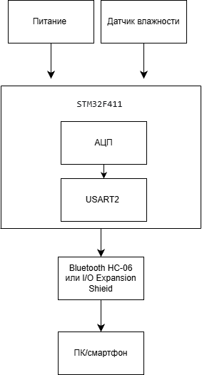
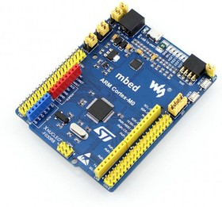
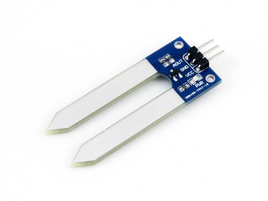
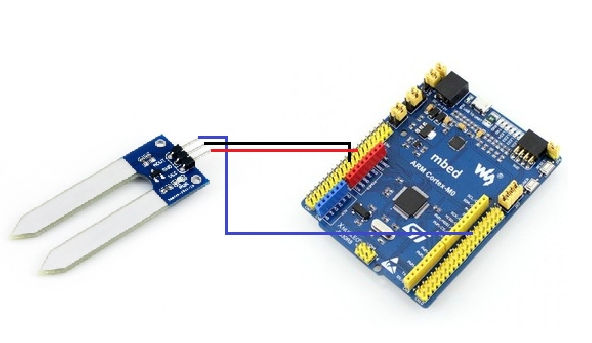
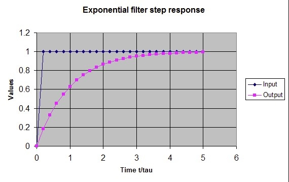
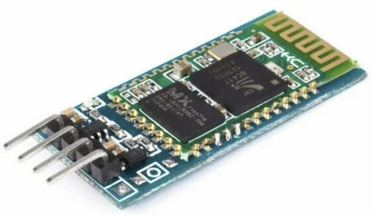
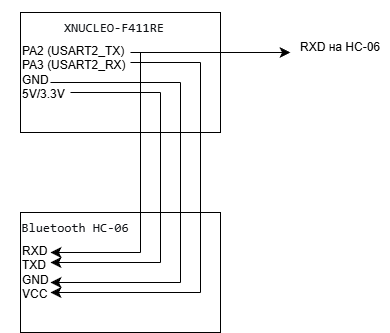

:toc: 
:toc-title: ОГЛАВЛЕНИЕ
:stem:
:stem: latexmath
:toclevels: 2
:figure-caption: Рисунок
:table-caption: Таблица 

[.text-center]
Южно-Уральский государственный университет (НИУ)
Высшая школа электроники и компьютерных наук
Кафедра «Информационно-измерительная техника»

[.text-right]
УТВЕРЖДАЮ +
Заведующий кафедрой +
&#95;&#95;&#95;&#95;&#95;&#95;&#95;&#95;&#95;&#95; (М.Н. Самодурова) +
&#95;&#95;&#95;&#95;&#95;&#95;&#95;&#95;&#95;&#95;&#95;&#95;&#95;&#95;&#95; 2026 г.

[.text-center]
*ЗАДАНИЕ НА РАБОТУ* +
на курсовую работу студенту: +
Володиной Екатерине Алексеевне +
группа: КЭ-413

{nbsp} +
{nbsp} +
{nbsp} +

[.text-left]
. *Дисциплина:* *_Программное обеспечение измерительных процессов._*
. *Тема работы:* *_Разработка устройства измерения влажности почвы_*
. *Требования к разработке:*
* Для разработки должна использоваться отладочная плата https://www.waveshare.com/product/arduino-2/boards-kits/nucleo/xnucleo-f411re.htm[XNUCLEO-F411RE]
* Питание платы должно быть автономным и подаваться с солнечный батарей
* Устройство должно измерять влажность почвы
** Для измерения должен использоваться встроенный АЦП микроконтроллера STM32F411
** Период измерения должен быть 100 ms
** Для получения кодов АЦП  должен использоваться механизм DMA
** Для изменения влажности должен использоваться датчик влажности почвы https://www.waveshare.com/product/Moisture-Sensor.htm[Moisture Sensor]
** Погрешность измерения влажности почвы не должна превышать 5% в диапазоне от 0 до 60%
** К измеренному значению должен быть применен цифровой фильтр вида: +
latexmath:[\tau = \begin{cases} 
               \left(1 - e^{-\frac{dt}{R \cdot C}}\right), & \text{если } R \cdot C > 0 \text{ сек} \\
              1, & \text{если } R \cdot C \leq 0 \text{ сек}
           \end{cases}]
 
\$"FilteredValue" = "OldFiltered" + ("Value" - "OldValue") * tau\$,

где dt -  100 мс; +
Value – текущее нефильтрованное измеренное значение влажности; +
oldValue -  предыдущее фильтрованное значение.

* Передача значений по беспроводному интерфейсу должна осуществляться через модуль https://elecfreaks.com/estore/download/EF03073-Bluetooth_Bee_(HC-05_and_HC-06)User_Guide.pdf[BlueTooth Bee HC-06]
или https://www.waveshare.com/product/arduino-2/shields/others/io-expansion-shield.htm[I/O Expansion Shield]
** Общение с платой расширения должно осуществляться через USART2
** формат вывод: +
   "Влажность почвы: " XXX.XX [Units]
* Архитектура должна быть представлена в виде UML диаграмм в пакете Star UML
* Приложение должно быть написано на языке С++ с использование компилятора ARM 8.40.2
* При разработке должна использоваться Операционная Система Реального Времени FreeRTOS и https://github.com/lamer0k/RtosWrapper[С++ обертка над ней]

[start=4]

. *Перечень вопросов, подлежащих разработке:*
* В ходе работы необходимо разработать архитектуру программного обеспечения в виде диаграммы UML.
* В ходе работы необходимо разработать код программного обеспечения.
** Код должен соответствовать стандарту кодирования https://tproger.ru/translations/stanford-cpp-style-guide/[Стэнфордского университета], см также https://stanford.edu/class/archive/cs/cs106b/cs106b.1158/styleguide.shtml[оригинал]
* Работа программы должна быть продемонстрирована совместно с платой XNUCLEO-F411RE.
* Содержание работы должно соответствовать ГОСТ 19.402–78 «Единая система программной документации. Описание программы».
** работа должна быть оформлена в формате Asciidoc и выложена на Github
* Описание архитектуры в виде UML диаграмм должно быть оформлено в разделе «Описание логической структуры» -> “Алгоритм программы”.
* Дополнительно к архитектуре, в разделе «Описание логической структуры» -> “Структура программы с описанием функций составных частей и связи между ними” должен быть описан принцип работы программы и взаимодействия разных блоков программы друг с другом.
* Оформление пояснительной записки к курсовой работе в соответствии с СТО ЮУрГУ 04–2008 «Курсовое и дипломное проектирование. Общие требования к содержанию и оформлению».

. *Календарный план:*
* Сдача этапов выполнения курсовой работы осуществляется строго в соответствии с календарным планом.

[cols="4,3,2"]
|===
|Наименование разделов курсовой работы |Срок выполнения разделов работы |Отметка руководителя о выполнении

|Разработка общей архитектуры программы
|28 марта 2026 г.
|

|Разработка кода каркаса программы
|4 апреля 2026 г.
|

|Разработка детальной архитектуры модуля работы с датчиком
|11 апреля 2026 г.
|

|Разработка кода для модуля работы с датчиком
|11 апреля 2026 г.
|

|Разработка детальной архитектуры модуля работы с индикатором
|18 апреля 2026 г.
|

|Разработка кода для модуля работы с индикатором
|18 апреля 2026 г.
|

|Разработка детальной архитектуры модуля работы с USART и блутуз
|25 апреля 2026 г.
|

|Разработка кода для модуля работы  с USART и блутуз
|25 апреля 2026 г.
|

|Разработка детальной архитектуры и кода для оставшихся модулей
|2 мая 2026 г.
|

|Сдача и демонстрация работы устройства
|9 мая 2026 г.
|

|Оформление пояснительной записки к курсовой работе
|20 мая 2026 г.
|

|===

{nbsp} +
{nbsp} +

Руководитель работы:  &#160;&#160;&#160;&#160;&#160;&#160;&#160;&#160;&#160;&#160;&#160;&#160;&#160;&#160;&#160;&#160;&#160;&#160;&#160;&#95;&#95;&#95;&#95;&#95;&#95;&#95;&#95;&#95;&#95;&#95;&#95;&#95;&#95;&#95;&#95;&#95;&#95;&#95;&#95;&#95;&#95;&#95;&#95;&#95;&#95;&#95;&#95;&#95;&#95;&#95;&#95;&#95;&#95;&#95;&#95;&#95;&#95;&#95;&#95;&#95;/С. В. Колодий/ +
[.text-center]
(подпись) +

[.text-left]
Володина Е.А. &#160;&#160;&#160;&#160;&#160;&#160;&#160;&#160;&#160;&#160;&#160;&#160;&#160;&#160;&#160;&#160;&#160;&#160;&#160;&#160;&#160;&#160;&#160;&#160;&#160;&#160;&#160;&#160;&#160;&#160;&#160;&#160;&#160;&#160;&#160;&#160;&#160;&#160;&#160;&#160;&#160;&#160;&#160;&#160;&#160;&#160; &#95;&#95;&#95;&#95;&#95;&#95;&#95;&#95;&#95;&#95;&#95;&#95;&#95;&#95;&#95;&#95;&#95;&#95;&#95;&#95;&#95;&#95;&#95;&#95;&#95;&#95;&#95;&#95;&#95;&#95;&#95;&#95;&#95;&#95;&#95;&#95;&#95;&#95;&#95;&#95;&#95;/&#160;&#160;&#160;&#160;&#160;&#160;&#160;&#160;&#160;&#160;&#160;&#160;&#160;&#160;&#160;&#160;&#160;&#160;&#160;&#160;&#160;&#160; / +

[.text-center]
(подпись) +

<<<

== Анализ требований к разработке

В этом разделе разбирается, из чего состоит устройство, как работают его части и почему выбраны именно такие настройки.

=== Функциональная схема устройства

.Общая функциональная схема устройства

=== Основные блоки

* Питание
* Датчик влажности
* STM32F411
* USART2 
* Bluetooth HC-06
* I/O Expansion Shield

==== Описание работы

Питание обеспечивает энергией все компоненты. Датчик влажности собирает данные об окружающей среде и передаёт их в микроконтроллер STM32F411. Микроконтроллер обрабатывает сигналы с датчика и управляет передачей данных. Через USART2 Driver данные поступают на модуль Bluetooth HC-06, который по радиоканалу отправляет их на ПК или смартфон. При необходимости вместо Bluetooth может использоваться I/O Expansion Shield для подключения дополнительной периферии.

==== Назначение устройства

Сбор и беспроводная передача данных о влажности.

*Для чего всё это нужно*

Устройство измеряет влажность почвы. Датчик выдает напряжение: чем мокрее земля, тем выше напряжение. Микроконтроллер измеряет это напряжение, переводит в проценты, убирает помехи и отправляет результат по Bluetooth на телефон или компьютер.

=== Отладочная плата XNUCLEO-F411RE

Это основа устройства. На ней установлен микроконтроллер STM32F411RET6.

Основные характеристики:

- Ядро: ARM Cortex-M4, 100 МГц
- Память: 512 КБ Flash, 128 КБ SRAM
- Питание: 1.7 – 3.6 В
- Встроенный АЦП (12 бит, 16 каналов)
- Поддержка DMA, USART, SPI, I2C

Плата выбрана потому, что у неё есть всё необходимое: АЦП для измерения, DMA для быстрой передачи данных, USART для связи с Bluetooth.

.Отладочная плата XNUCLEO-F411RE

=== Датчик влажности Moisture Sensor

Датчик представляет собой две металлические пластины в форме вилки. При погружении в почву сопротивление между пластинами меняется в зависимости от влажности.

.Внешний вид датчика

Технические характеристики:

- Глубина обнаружения: 38 мм
- Напряжение питания: 2 – 5 В
- Размеры: 20 × 51 мм

Подключение датчика к плате:

[cols="1,1,2", options="header"]
|===
| Контакт датчика | Плата XNUCLEO | Назначение
| VCC | 3.3 V | Питание
| GND | GND | Общий провод
| AOUT | PB1 | Аналоговый выход (0 – 3.3 В)
|===

.Схема подключения датчика

Сигнал с выхода AOUT поступает на аналоговый вход PB1 микроконтроллера. Далее он обрабатывается встроенным АЦП.

=== Алгоритм калибровки датчика влажности

==== Термостатно-весовой метод

Метод основан на испарении воды при нагревании: масса сухой почвы постоянна, разность масс до и после сушки равна массе воды.

*Необходимое оборудование:*

- Весы лабораторные (точность ±0,01 г), в нашем случае кухонные весы
- Сушильный шкаф (105 ± 5 °С), в нашем случае духовой шкаф
- Ёмкости для образцов
- Десикатор (для охлаждения без поглощения влаги из воздуха)

*Порядок действий:*

. Взвесить ёмкость с влажной почвой: stem:[m_{вл}]
. Высушить при 105 °C 4–6 часов до постоянной массы
. Охладить в десикаторе и взвесить: stem:[m_{сух}]
. Вычислить влажность по формуле:

+
[stem]
++++
W = \frac{m_{вл} - m_{сух}}{m_{сух} - m_{б}} \cdot 100\%
++++
+
где stem:[m_{б}] — масса пустой ёмкости (бюкса).

Ввиду отсутствия лабораторного десикатора, охлаждение образцов производится в выключенной духовке с приоткрытой дверцей в течение 30 минут. Это исключает повторное насыщение образца влагой из воздуха, так как внутри духовки сохраняется сухой горячий воздух.

*Расчёт образцов*

Масса пустой ёмкости: stem:[m_{б} = 50] г.

Масса сухой почвы во всех образцах постоянна и составляет 100 г.  
Следовательно, масса ёмкости с сухой почвой:
[stem]
++++
m_{сух} = m_{б} + 100 = 50 + 100 = 150 \text{ г}
++++

[cols="1,1,1,1,1", options="header"]
|===
| Образец | stem:[m_{б}] (г) | stem:[m_{вл}] (г) | stem:[m_{сух}] (г) | Влажность stem:[W] (%)
| №1 (сухой) | 50 | 150 | 150 | stem:[\frac{150-150}{150-50} \cdot 100\% = 0\%]
| №2 (20%) | 50 | 170 | 150 | stem:[\frac{170-150}{150-50} \cdot 100\% = 20\%]
| №3 (40%) | 50 | 190 | 150 | stem:[\frac{190-150}{150-50} \cdot 100\% = 40\%]
| №4 (60%) | 50 | 210 | 150 | stem:[\frac{210-150}{150-50} \cdot 100\% = 60\%]
|===

Таким образом, для получения образцов с заданной влажностью необходимо добавить следующее количество воды к 100 г сухой почвы:

[cols="1,1,1", options="header"]
|===
| Желаемая влажность | Масса сухой почвы | Добавляемая вода
| 20% | 100 г | 20 г
| 40% | 100 г | 40 г
| 60% | 100 г | 60 г
|===

==== Снятие показаний АЦП и преобразование в напряжение

===== Снятие показаний

Для каждого из четырёх образцов (0%, 20%, 40%, 60%) выполнить:

. Погрузить датчик в почву.
. Подождать 30 секунд для стабилизации.
. Записать значение АЦП в таблицу.

В результате получается таблица калибровочных пар:

[cols="1,1", options="header"]
|===
| Влажность stem:[W] (%) | Код АЦП stem:[D_{raw}]
| 0 | stem:[D_0]
| 20 | stem:[D_{20}]
| 40 | stem:[D_{40}]
| 60 | stem:[D_{60}]
|===

===== Преобразование кода АЦП в напряжение

АЦП микроконтроллера STM32F411 имеет разрядность 12 бит.  
Связь между входным напряжением stem:[V_{in}] и кодом АЦП stem:[D] задаётся формулой:

[stem]
++++
D = \frac{V_{in}}{V_{ref}} \cdot 4095, \quad V_{ref} = 3.3 \text{ В}
++++

Обратное преобразование (для получения напряжения):

[stem]
++++
V_{in} = \frac{D}{4095} \cdot 3.3
++++

Применяя это преобразование к каждому образцу, получаем таблицу калибровочных пар «напряжение — влажность»:

[cols="1,1", options="header"]
|===
| Влажность stem:[W] (%) | Напряжение stem:[V_{in}] (В)
| 0 | stem:[V_0 = \frac{D_0}{4095} \cdot 3.3]
| 20 | stem:[V_{20} = \frac{D_{20}}{4095} \cdot 3.3]
| 40 | stem:[V_{40} = \frac{D_{40}}{4095} \cdot 3.3]
| 60 | stem:[V_{60} = \frac{D_{60}}{4095} \cdot 3.3]
|===

==== Полиномиальная аппроксимация

Для преобразования измеренного напряжения stem:[V_{in}] в значение влажности stem:[H] (в процентах) используется полином третьей степени:

[stem]
++++
H = a_3 \cdot V_{in}^3 + a_2 \cdot V_{in}^2 + a_1 \cdot V_{in} + a_0
++++

*Получение коэффициентов*

Датчик помещается в образцы с эталонной влажностью (0%, 20%, 40%, 60%). Для каждого образца фиксируется соответствующее напряжение stem:[V_{in}].

Получается система уравнений:

[stem]
++++
\begin{cases}
a_3 V_0^3 + a_2 V_0^2 + a_1 V_0 + a_0 = 0 \\
a_3 V_{20}^3 + a_2 V_{20}^2 + a_1 V_{20} + a_0 = 20 \\
a_3 V_{40}^3 + a_2 V_{40}^2 + a_1 V_{40} + a_0 = 40 \\
a_3 V_{60}^3 + a_2 V_{60}^2 + a_1 V_{60} + a_0 = 60
\end{cases}
++++

Коэффициенты stem:[a_0, a_1, a_2, a_3] вычисляются методом наименьших квадратов с использованием табличного процессора (Excel):

. Внести в таблицу пары stem:[(V_{in}, W)] для четырёх образцов.
. Построить диаграмму рассеяния.
. Добавить полиномиальную линию тренда 3-й степени.
. Отобразить уравнение на графике.

*Итоговая формула*

[stem]
++++
H = a_3 \cdot V_{in}^3 + a_2 \cdot V_{in}^2 + a_1 \cdot V_{in} + a_0
++++

где stem:[V_{in} = \frac{D_{raw}}{4095} \cdot 3.3].

*Ограничение результата*

[stem]
++++
H = \max(0,\; \min(100,\; H))
++++

Эта формула гарантирует, что значение влажности остаётся в диапазоне от 0% до 100% даже при выбросах АЦП.

=== Аналого-цифровой преобразователь (АЦП)

АЦП превращает напряжение в цифровой код. Чем выше напряжение, тем больше число на выходе.

Микроконтроллер STM32F411 имеет 12-битный АЦП. Это означает, что входное напряжение преобразуется в число от 0 до 4095:

- 0 В > 0
- 1.65 В > 2048
- 3.3 В > 4095

Для работы АЦП необходимо настроить регистры микроконтроллера.

.Настройка регистров АЦП

|===
| Этап | Регистр | Биты | Значение | Назначение
| Тактирование порта B | RCC_AHB1ENR | GPIOBEN | 1 | Включить питание порта B
| Настройка пина PB1 | GPIOB_MODER | MODER0 | 11 | Режим аналогового входа
| Отключение подтяжки | GPIOA_PUPDR | PUPDR0 | 00 | Убрать лишние резисторы
| Тактирование АЦП1 | RCC_APB2ENR | ADC1EN | 1 | Подать питание на АЦП
| Тактирование DMA2 | RCC_AHB1ENR | DMA2EN | 1 | Включить DMA (понадобится позже)
| Разрешение 12 бит | ADC_CR1 | RES | 00 | Получить значения 0–4095
| Флаг после каждого канала | ADC_CR2 | EOCS | 1 | Сигнал об окончании измерения
| Непрерывный режим | ADC_CR2 | CONT | 1 | АЦП работает постоянно
| Время выборки 480 тактов | ADC_SMPR2 | SMP0 | 111 | Обеспечивает 12-битную точность при высоком выходном сопротивлении датчика
|===

Если время выборки слишком мало, конденсатор выборки-хранения не успевает зарядиться до реального напряжения датчика. При высоком выходном сопротивлении датчика (особенно в сухой почве) требуется больше времени для заряда.

Значение 480 тактов является максимальным в STM32F411. Оно гарантирует точность 12 бит для любого источника сигнала с сопротивлением до нескольких сотен килоом. При частоте АЦП 30 МГц это даёт время выборки около 16 мкс, что составляет лишь 0,016% от периода измерения 100 мс. Таким образом, выбор максимального времени выборки не снижает производительность, но обеспечивает максимальную точность и надёжность измерений.

==== Преобразование в напряжение

Объект `Voltage` переводит сырой код АЦП (0..4095) в напряжение по формуле:

Напряжение = gain × код_АЦП + offset

Параметры `gain` и `offset` передаются как шаблонные аргументы при создании объекта. В данной конфигурации:

* `gain = 3.3 / 4095 = 0.000806206`
* `offset = 0`

Это обеспечивает соответствие: код 4095 → 3.3 В, код 0 → 0 В.
**Результат:** Получено напряжение в вольтах (0..3.3 В).

==== Описание настройки регистров АЦП

Представленная таблица отражает последовательность конфигурации регистров для организации аналого-цифрового преобразования сигнала с датчика влажности. Настройка выполняется в несколько логических этапов.

**1. Тактирование и настройка порта ввода-вывода**

На первом этапе включается тактирование порта B установкой бита `GPIOBEN` в регистре `RCC_AHB1ENR`. Это необходимо для подачи тактового сигнала на периферийный модуль GPIOB, к которому подключён аналоговый датчик.

В регистре `GPIOB_MODER` для пина PB0 (биты `MODER0[1:0]`) устанавливается значение `11`, что переводит вывод в режим аналогового входа. В регистре `GPIOA_PUPDR` для этого же пина биты `PUPDR0[1:0]` устанавливаются в `00`, отключая как подтяжку вверх, так и подтяжку вниз. Это необходимо для исключения влияния внутренних резисторов на измеряемый аналоговый сигнал и обеспечения максимальной точности оцифровки.

**2. Тактирование АЦП и DMA**

Для работы АЦП необходимо включить его тактирование. В регистре `RCC_APB2ENR` устанавливается бит `ADC1EN` (бит 8), подающий тактовый сигнал на модуль ADC1. Одновременно в регистре `RCC_AHB1ENR` устанавливается бит `DMA2EN` (бит 22), включающий тактирование контроллера DMA2, который будет использоваться для автоматической пересылки результатов преобразования в память.

**3. Настройка разрешения АЦП**

В регистре `ADC_CR1` биты `RES[25:24]` устанавливаются в `00`, что соответствует разрешению 12 бит. Это максимальное разрешение для данного АЦП, обеспечивающее 4096 градаций входного сигнала и наилучшую точность измерения.

**4. Настройка режима работы**

В регистре `ADC_CR2` конфигурируются следующие параметры:
* Бит `EOCS` (бит 10) устанавливается в `1`, что предписывает устанавливать флаг окончания преобразования после каждого измеренного канала, а не после всей последовательности.
* Бит `CONT` (бит 1) устанавливается в `1`, переводя АЦП в режим непрерывного преобразования. В этом режиме после завершения одного измерения автоматически начинается следующее, что в сочетании с DMA обеспечивает непрерывный поток данных с заданным периодом.

**5. Настройка времени выборки**

В регистре `ADC_SMPR2` для канала 0 (к которому подключён PB0) биты `SMP0[2:0]` устанавливаются в значение `111`, что соответствует времени выборки 480 тактов. Выбор максимального времени выборки обусловлен высоким выходным сопротивлением датчика влажности почвы: более длительная выборка позволяет внутреннему конденсатору АЦП полностью зарядиться до уровня входного сигнала, минимизируя погрешность измерения. При периоде опроса 100 мс данная настройка не влияет на общую производительность системы.

=== Прямой доступ к памяти (DMA)

DMA позволяет передавать данные из АЦП в память без участия процессора. Процессор в это время может выполнять другие задачи.

Без DMA пришлось бы каждые 100 мс прерывать процессор и вручную читать значение. С DMA АЦП сам записывает результат в переменную.

.Настройка регистров DMA

|===
| Этап | Регистр | Биты | Значение | Назначение
| Разрешить DMA | ADC_CR2 | DMA | 1 | АЦП формирует запросы к DMA
| Постоянные запросы | ADC_CR2 | DDS | 1 | Генерировать новые запросы после каждого преобразования (режим непрерывной работы)
| Включить АЦП | ADC_CR2 | ADON | 1 | Запустить АЦП
| Непрерывный режим | ADC_CR2 | CONT | 1 | АЦП работает без остановки
| Канал DMA для ADC1 | DMA2_Stream0_CR | CHSEL | 001 | Выбрать нужный канал
| Направление: периферия → память | DMA2_Stream0_CR | DIR | 00 | Из АЦП в переменную
| Не увеличивать адрес памяти | DMA2_Stream0_CR | MINC | 0 | Всегда писать в одно место
| Не увеличивать адрес периферии | DMA2_Stream0_CR | PINC | 0 | АЦП всегда по одному адресу
| Кольцевой режим | DMA2_Stream0_CR | CIRC | 1 | Бесконечно повторять
| Включить DMA | DMA2_Stream0_CR | EN | 1 | Запустить передачу
| Количество передач | DMA2_Stream0_NDTR | NDT | 1 | Передавать одно значение
| Адрес источника (АЦП) | DMA2_Stream0_PAR | — | &ADC1->DR | Откуда брать данные
| Адрес приёмника | DMA2_Stream0_M0AR | — | &data | Куда сохранять
| Запуск АЦП | ADC_CR2 | SWSTART | 1 | Начать преобразование
|===

В данном проекте передаётся только одно значение (`N = 1`), так как достаточно самого свежего измерения.

Представленная таблица отражает последовательность настройки регистров для организации передачи данных от аналого-цифрового преобразователя в память микроконтроллера с использованием механизма прямого доступа к памяти (DMA). Конфигурация выполняется в три этапа.

На первом этапе производится включение поддержки DMA в модуле АЦП. Для этого в регистре ADC_CR2 устанавливаются биты:

DMA — разрешает формирование запросов к контроллеру DMA;

DDS — обеспечивает выдачу запросов DMA непрерывно в процессе преобразования;

ADON — активирует работу АЦП;

CONT — переводит АЦП в непрерывный режим измерений.

На втором этапе настраивается поток контроллера DMA (в данном случае DMA2_Stream0). В регистре DMA2_Stream0_CR задаются ключевые параметры передачи:

Выбирается канал, соответствующий ADC1;

Устанавливается направление передачи «из периферии в память»;

Запрещается инкремент адресов как периферии, так и памяти (так как данные всегда читаются из одного регистра ADC1_DR и могут сохраняться в один и тот же буфер);

Включается кольцевой режим, обеспечивающий циклическую перезапись буфера;

Устанавливается бит разрешения работы потока EN.

На третьем этапе задаются параметры передаваемого блока данных:

В регистре DMA2_Stream0_NDTR указывается количество передаваемых значений N (например, N = 100);

В регистре DMA2_Stream0_PAR фиксируется адрес источника — регистр данных АЦП (&ADC1→DR);

В регистре DMA2_Stream0_M0AR указывается адрес приёмника — переменная или буфер в оперативной памяти (&data_buffer).

Запуск процесса преобразования осуществляется программно установкой бита SWSTART в регистре ADC_CR2. После этого АЦП начинает непрерывно выполнять измерения, а контроллер DMA автоматически пересылает каждый полученный результат в заданную область памяти без участия центрального процессора.

Описанная конфигурация полностью соответствует требованиям технического задания: используется встроенный АЦП микроконтроллера STM32F411, получение кодов АЦП организовано через механизм DMA, что позволяет разгрузить процессорное ядро и обеспечить стабильный период измерений 100 мс.

Особенности реализации
В данном проекте передаётся только одно значение (NDT = 1), так как для управления системой достаточно самого свежего измерения влажности почвы.

=== Цифровой фильтр

==== Математическая модель цифрового фильтра

Данная модель представляет собой БИХ-фильтр (фильтр с бесконечной импульсной характеристикой), который требует хранения только одного предыдущего выходного значения и обеспечивает эффективное подавление случайных помех измерений.

[mermaid]
....
flowchart TB
    subgraph Inputs["Входные сигналы"]
        V_raw["V_raw (напряжение с датчика, В)"]
        Coeff["a0, a1, a2, a3 (коэфф. полинома)"]
    end

    subgraph Step1["Шаг 1: Полином"]
        Poly["Полином 3-й степени
H_raw = a3*V_raw^3 + a2*V_raw^2 + a1*V_raw + a0"]
    end

    subgraph Step2["Шаг 2: Фильтр"]
        Tau["tau = 1 - exp(-dt / RC)
dt = 0.1 с, RC = 5 с"]
        Filter["Экспоненциальный фильтр
H_filt[k] = H_filt[k-1] + tau * (H_raw - H_filt[k-1])"]
    end

    subgraph Step3["Шаг 3: Ограничение"]
        Clip["Ограничение
H = max(0, min(100, H_filt))"]
    end

    subgraph Output["Выход"]
        Result["Влажность H [%]"]
    end

    V_raw --> Poly
    Coeff --> Poly
    Poly -->|H_raw| Filter
    Tau --> Filter
    Filter -->|H_filt| Clip
    Clip -->|H| Result

    style Inputs fill:#FFFFFF,stroke:#1565C0,stroke-width:2px,color:#000
    style Step1 fill:#FFFFFF,stroke:#6A1B9A,stroke-width:2px,color:#000
    style Step2 fill:#FFFFFF,stroke:#2E7D32,stroke-width:2px,color:#000
    style Step3 fill:#FFFFFF,stroke:#C62828,stroke-width:2px,color:#000
    style Output fill:#FFFFFF,stroke:#006064,stroke-width:2px,color:#000

    style V_raw fill:#FFFFFF,stroke:#1565C0,color:#000
    style Coeff fill:#FFFFFF,stroke:#1565C0,color:#000
    
    style Poly fill:#FFFFFF,stroke:#6A1B9A,color:#000
    style Tau fill:#FFFFFF,stroke:#2E7D32,color:#000
    style Filter fill:#FFFFFF,stroke:#2E7D32,color:#000
    style Clip fill:#FFFFFF,stroke:#C62828,color:#000
    style Result fill:#FFFFFF,stroke:#006064,color:#000
....

==== Описание алгоритма обработки сигнала

На рисунке представлена блок-схема алгоритма обработки сигнала с датчика влажности почвы. Ниже даётся пояснение каждого этапа.

===== Входные сигналы

* *V_raw (напряжение с датчика, В)* — значение напряжения, полученное после преобразования кода АЦП по формуле stem:[V_{in} = \frac{D}{4095} \cdot 3.3]. Это напряжение находится в диапазоне от 0 до 3.3 В.

* *a0, a1, a2, a3 (коэффициенты)* — коэффициенты полинома третьей степени, полученные в результате калибровки (см. раздел <<Полиномиальная аппроксимация>>). Они позволяют преобразовать измеренное напряжение в проценты влажности с учётом нелинейности датчика.

*Как получить калибровочные напряжения:*

Для калибровки используются четыре образца с эталонной влажностью (0%, 20%, 40%, 60%), приготовленные термостатно-весовым методом:

. Погрузить датчик в образец с известной влажностью.
. Подождать 30 секунд для стабилизации.
. Записать значение АЦП и перевести его в напряжение по формуле stem:[V = \frac{D}{4095} \cdot 3.3].

В результате получаются четыре пары «напряжение — влажность»: stem:[(V_0, 0\%)], stem:[(V_{20}, 20\%)], stem:[(V_{40}, 40\%)], stem:[(V_{60}, 60\%)], которые используются для расчёта коэффициентов полинома.

===== Шаг 1: Полином

Измеренное напряжение подаётся на вход полинома третьей степени:

[stem]
++++
H_{raw} = a_3 \cdot V_{raw}^3 + a_2 \cdot V_{raw}^2 + a_1 \cdot V_{raw} + a_0
++++

*Зачем это нужно:* Зависимость между напряжением на датчике и реальной влажностью почвы — нелинейная. Полином третьей степени позволяет достаточно точно аппроксимировать эту зависимость. Коэффициенты подбираются экспериментально во время калибровки.

На выходе полинома получается сырое (ещё не отфильтрованное) значение влажности в процентах, но пока с шумами.

===== Шаг 2: Фильтр

Аналоговый датчик влажности даёт много шумов. Значения прыгают, даже если влажность не меняется. Чтобы убрать эти случайные колебания, применяется цифровой фильтр.

Используется экспоненциальный фильтр первого порядка. Он работает по формуле:

[.text-center]
stem:[FilteredValue = OldFiltered + (Value - OldValue) \times \tau] +
{nbsp} +

Где:

- `Value` — только что измеренное значение (с шумом)
- `OldFiltered` — предыдущее отфильтрованное значение
- `tau` — коэффициент сглаживания (от 0 до 1)

Чем меньше `tau`, тем сильнее сглаживание.

Коэффициент `tau` вычисляется так:

[.text-center]
stem:[\tau = 1 - \exp\left(-\frac{dt}{R \cdot C}\right)] +
{nbsp} +

Расчёт `tau` для данного проекта:

[.text-center]
stem:[\tau = 1 - \exp\left(-\frac{0.1}{5}\right) = 1 - \exp(-0.02) \approx 0.02 \text{ (2\%)}] +
{nbsp} +

Это означает, что каждые 100 мс фильтр заменяет всего 2% от разницы между старым и новым значением. Полное обновление происходит примерно за 5 секунд.

.Влияние параметра RC на сглаживание

|===
| RC (с) | tau (при dt = 100 мс) | Характер работы
| 0.1 | 0.63 | Быстрая реакция, слабое сглаживание
| 0.5 | 0.18 | Умеренное сглаживание
| 1.0 | 0.095 | Сильное сглаживание
| 5.0 | 0.02 | Очень сильное сглаживание (выбрано)
|===

===== Шаг 3: Ограничение

После фильтрации значение может выйти за физически возможные пределы:

[stem]
++++
H = \max(0,\; \min(100,\; H_{filt}))
++++

*Зачем это нужно:* Из-за шумов или неидеальной калибровки рассчитанная влажность может оказаться меньше 0% или больше 100%. Ограничение гарантирует, что на выход всегда попадают корректные значения в диапазоне от 0 до 100%.

===== Сводная таблица этапов

[options="header"]
|===
| Этап | Вход | Выход | Назначение
| Полином | `V_raw`, `a0...a3` | `H_raw` (%) | Учёт нелинейности датчика
| Фильтр | `H_raw`, `tau` | `H_filt` (%) | Подавление высокочастотных шумов
| Ограничение | `H_filt` (%) | `H` (%) | Гарантия корректного диапазона 0…100%
|===

.График работы фильтра

Почему выбрано сильное сглаживание?

- Влажность почвы не может измениться за доли секунды
- Датчик даёт много высокочастотных шумов
- Запаздывание в 5 секунд некритично для данной задачи

Фильтр жертвует скоростью ради точности. Вместо нервных прыжков цифр на экране вы видите плавное и понятное изменение влажности.

==== Что означают линии на графике

* *Синяя линия (Input)* — то, что на самом деле измерил датчик. Например, влажность резко подскочила с 0% до 100% (полили цветок).
* *Красная линия (Output)* — то, что показывает фильтр после обработки.

==== Что происходит на графике

. В начале (левая часть графика) входной сигнал = 0, выходной тоже = 0.
. В момент времени stem:[t = 0] датчик резко показал 100% (синяя линия прыгает вверх).
. Фильтр (красная линия) не прыгает сразу. Он плавно ползёт вверх.

==== Почему фильтр не прыгает сразу

Потому что фильтр «не верит» резким скачкам. Он как бы проверяет: «Может, это просто помеха? Посмотрю ещё пару секунд…»

==== Скорость сглаживания

* Через время stem:[t = \tau] (одна «постоянная времени») фильтр достигает примерно 63% от реального значения.
* Через stem:[t = 3\tau] — около 95%.
* Через stem:[t = 5\tau] — более 99% (почти совпал с реальностью).

==== Для нашего проекта

* Мы выбрали постоянную времени stem:[RC = \tau = 5] секунд.
* Это значит: после того как влажность реально изменилась (например, полили цветок), фильтр покажет правдивое значение примерно через stem:[5 \times 5 = 25] секунд.

==== Зачем так медленно?

* Датчик влажности почвы очень шумный — его значения прыгают туда-сюда, даже если влажность не меняется.
* Медленный фильтр убивает эти случайные прыжки.
* Влажность почвы не может измениться за доли секунды, поэтому 25 секунд ожидания — это нормально и незаметно для пользователя.

==== Главная мысль

Фильтр жертвует скоростью ради точности. Вместо нервных прыжков цифр на экране вы видите плавное и понятное изменение влажности.

=== Операционная система реального времени FreeRTOS

FreeRTOS — это операционная система для микроконтроллеров. Она позволяет запускать несколько задач, которые работают псевдопараллельно.

В проекте используется обёртка RtosWrapper, которая даёт удобный C++ интерфейс.

==== Что такое RtosWrapper

RtosWrapper — это библиотека-обёртка над FreeRTOS, написанная на C++.

Зачем она нужна? FreeRTOS изначально написана на языке C. Это значит, что при работе с ней приходится использовать функции в стиле C: передавать указатели, писать отдельные функции для задач, вручную выделять память под стеки. Это работает, но код получается громоздким и не очень похожим на современный C++.

RtosWrapper прячет всю сложность C-интерфейса и даёт программисту удобные C++-инструменты: классы, объекты, понятные названия методов. Код становится чище, а писать его — быстрее и приятнее.

Основные компоненты RtosWrapper:

|===
| Компонент | Назначение | Пример
| `Thread<размер>` | Базовый класс задачи | `class MyTask : public Thread<512>`
| `Execute()` | Основной цикл задачи | `void MyTask::Execute()`
| `Sleep(время)` | Заснуть на указанное время | `Sleep(100ms)`
| `SleepUntil(время)` | Заснуть до указанного момента | `SleepUntil(1000ms)`
| `CreateThread()` | Создать и запустить задачу | `Rtos::CreateThread(task, "name", priority)`
| `Rtos::Start()` | Запустить планировщик | `Rtos::Start()`
|===

=== Bluetooth-модуль HC-06

Модуль HC-06 обеспечивает беспроводную передачу данных. Он работает по протоколу Bluetooth 2.0 (SPP-профиль) в режиме ведомого устройства (slave). Это значит, что модуль не инициатор соединения, а только ожидает подключения с телефона или ноутбука.

.Внешний вид модуля HC-06

Технические характеристики:

|===
| Параметр | Значение
| Напряжение питания | 3.3 – 6 В
| Рабочий ток | ≈40 мА
| Дальность связи | до 10 м (открытое пространство)
| Скорость по умолчанию | 9600 бод
| Режим работы | Slave (ведомый)
|===

==== Режимы работы Bluetooth

Bluetooth-модули могут работать в двух режимах:

* *Master (ведущий)* — устройство само ищет другие Bluetooth-устройства и подключается к ним. Например: телефон ищет наушники.

* *Slave (ведомый)* — устройство не ищет само, а только отвечает на запросы. Оно транслирует своё имя и ждёт подключения. Например: Bluetooth-колонка, к которой подключается телефон.

Модуль HC-06 работает **только в режиме Slave**. Для нашей задачи это правильно: датчик влажности не должен сам искать телефон, достаточно того, что телефон может его найти и подключиться.

Подключение к плате XNUCLEO-F411RE:

|===
| HC-06 | XNUCLEO-F411RE | Назначение
| VCC | 3.3 В или 5 В | Питание
| GND | GND | Общий провод
| TXD | PA3 (USART2_RX) | Передача данных от модуля к микроконтроллеру
| RXD | PA2 (USART2_TX) | Приём данных от микроконтроллера к модулю
|===

.Схема подключения Bluetooth-модуля

Настройка модуля выполняется с помощью AT-команд через последовательный порт:

[source, text]
----
AT                // проверка связи → ответ OK
AT+NAMEmydevice   // установить имя устройства "mydevice"
AT+BAUD4          // установить скорость 9600 (4 соответствует 9600)
AT+PIN1234        // установить PIN-код 1234
----

В данном проекте модуль используется с настройками по умолчанию (скорость 9600 бод, имя HC-06).

=== Настройка USART2

USART2 — это последовательный интерфейс, через который микроконтроллер общается с Bluetooth-модулем.

.Настройка регистров USART2

|===
| Этап | Регистр | Биты | Значение | Назначение
| Тактирование порта A | RCC_AHB1ENR | GPIOAEN | 1 | Включить питание порта A
| Тактирование USART2 | RCC_APB1ENR | USART2EN | 1 | Включить питание USART2
| Настройка PA2 как TX | GPIOA_MODER | MODER2 | 10 | Альтернативная функция
| Настройка PA3 как RX | GPIOA_MODER | MODER3 | 10 | Альтернативная функция
| AF7 для PA2 | GPIOA_AFRL | AFRL2 | 0111 | Альтернативная функция 7 (USART2)
| AF7 для PA3 | GPIOA_AFRL | AFRL3 | 0111 | Альтернативная функция 7 (USART2)
| Высокая скорость PA2 | GPIOA_OSPEEDR | OSPEEDR2 | 11 | Быстрый переключение
| Высокая скорость PA3 | GPIOA_OSPEEDR | OSPEEDR3 | 11 | Быстрый переключение
| Подтяжка PA2 | GPIOA_PUPDR | PUPDR2 | 01 | Подтяжка к питанию
| Подтяжка PA3 | GPIOA_PUPDR | PUPDR3 | 01 | Подтяжка к питанию
| Скорость 9600 бод | USART2_BRR | BRR | 0x16C | Рассчитано для частоты 16 МГц
| Включить USART | USART2_CR1 | UE | 1 | Запустить USART
| Включить передатчик | USART2_CR1 | TE | 1 | Разрешить отправку
| 8 бит данных | USART2_CR1 | M | 0 | 1 старт-бит + 8 данных + 1 стоп-бит
| 1 стоп-бит | USART2_CR2 | STOP | 00 | Один стоп-бит
| Без бита чётности | USART2_CR1 | PCE | 0 | Контроль чётности отключён
|===

Представленная таблица отражает последовательность настройки регистров для организации последовательной передачи данных через интерфейс USART2, к которому подключается Bluetooth-модуль HC-06. Конфигурация выполняется в три этапа.

На первом этапе производится включение тактирования необходимых периферийных модулей. В регистре `RCC_AHB1ENR` устанавливается бит `GPIOAEN`, разрешающий тактирование порта A, к которому подключены выводы USART2. В регистре `RCC_APB1ENR` устанавливается бит `USART2EN`, включающий тактирование самого модуля USART2.

На втором этапе настраиваются выводы микроконтроллера PA2 и PA3 для работы в режиме альтернативной функции USART2:

* В регистре `GPIOA_MODER` для пинов PA2 и PA3 устанавливается значение `10`, переводящее их в режим альтернативной функции.
* В регистре `GPIOA_AFRL` для PA2 и PA3 выбирается альтернативная функция AF7 (значение `0111`), соответствующая USART2.
* В регистре `GPIOA_OSPEEDR` для обоих пинов устанавливается высокая скорость переключения (значение `11`).
* В регистре `GPIOA_PUPDR` включается подтяжка вверх (значение `01`) для обеспечения стабильного уровня в состоянии покоя.

На третьем этапе конфигурируются параметры последовательной передачи данных в регистрах USART2:

* В регистр `USART2_BRR` записывается значение делителя тактовой частоты. При тактовой частоте шины APB1 16 МГц значение `0x16C` (десятичное 364) обеспечивает скорость передачи примерно 9600 бод в соответствии с формулой расчёта для режима 16-кратной передискретизации.
* В регистре `USART2_CR1` устанавливаются биты:
** `UE` — включение модуля USART;
** `TE` — включение передатчика;
** `M` = 0 — выбор формата кадра: 1 старт-бит, 8 бит данных;
** `PCE` = 0 — отключение контроля чётности.
* В регистре `USART2_CR2` биты `STOP` устанавливаются в `00`, что соответствует 1 стоп-биту.

Выбранная конфигурация соответствует стандартному формату кадра 8N1 (8 бит данных, без чётности, 1 стоп-бит), который является заводской настройкой Bluetooth-модуля HC-06. Это обеспечивает корректную передачу данных о влажности почвы на ПК или смартфон в соответствии с требованиями технического задания.

==== Обоснование выбора скорости 9600 бод

Скорость 9600 бод выбрана по следующим причинам:

* *Универсальность и совместимость:* Эта скорость является стандартом де-факто для начальной конфигурации и отладки последовательных интерфейсов. Модуль Bluetooth HC-06 по умолчанию настроен именно на 9600 бод, что исключает необходимость его перепрограммирования через AT-команды. Вероятность ошибок при первом подключении сводится к минимуму.

* *Достаточная производительность:* Для передачи коротких строк с показаниями влажности (например, `"Humidity: 45.67 %"`) длиной около 20 байт пропускной способности 9600 бит/с более чем достаточно. Даже при отправке данных каждые 100 мс (10 сообщений в секунду) загрузка канала не превышает 2–3%. Повышение скорости не даёт практического выигрыша, но усложняет настройку.

* *Надёжность связи:* На более низких скоростях (9600 бод и ниже) соединение менее требовательно к качеству сигнала, длине линии и наличию помех. Это особенно важно при работе с беспроводным модулем HC-06, который может работать в условиях нестабильного радиоканала. Высокая надёжность критична для стабильной работы устройства в полевых условиях.

* *Простота отладки:* Скорость 9600 бод поддерживается всеми терминальными программами (PuTTY, Minicom, Arduino IDE Monitor) без необходимости дополнительной настройки. Это упрощает отладку USART2 на этапе разработки.

Таким образом, в рамках данного проекта, где требуется организовать вывод строки через USART2 на модуль HC-06, использование заводской скорости 9600 бод является наиболее логичным, простым и надёжным решением.

include::arhitekturapo.adoc[]

include::eksperiment.adoc[]

