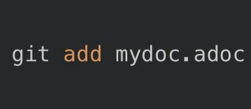
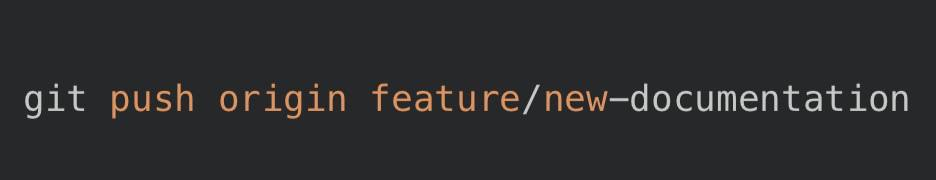

:toc:
:toc-title: ОГЛАВЛЕНИЕ

[.text-center]

= Лабораторная работа №3

[.text-center]

Использование GitHub и Visual Studio для управления версиями и работы с текстовыми документами

[.text-center]

Автор: Володина Екатерина 

[.text-center]

Группа: КЭ-413

<<<

[.text-left]

== ВВЕДЕНИЕ
В эпоху цифровизации и активного развития программного обеспечения, а также технической документации, эффективное управление проектами приобретает особую важность. Современные инструменты для контроля версий, такие как Git и его облачная платформа GitHub, позволяют разработчикам, техническим писателям и прочим участникам рабочих процессов организовывать совместную работу, отслеживать изменения и интегрировать различные версии проектов без потери данных и конфликтов. 

Visual Studio — одна из ведущих интегрированных сред разработки (IDE), предлагает встроенную поддержку систем контроля версий, что упрощает управление репозиториями и отправку изменений на удаленные серверы, включая GitHub. Для создания технической документации всё чаще используется формат AsciiDoc (.adoc), который наглядно и удобно структурирует текст и может быть интегрирован в процессы автоматической сборки документации.

В данном отчете подробно рассматривается работа с GitHub, создание веток в рамках git-репозитория, а также процесс отправки и управления текстовыми документами формата .adoc из среды Visual Studio. Это позволит продемонстрировать, как правильно организовать работу с проектом, улучшить совместную деятельность участников и сохранить контроль над качеством и релизами документации.

Цель работы: 

* Ознакомление с основными принципами и возможностями GitHub для управления версиями проектов;

* Описание механизма создания и использования веток (branches) в git;

* Инструкции и рекомендация по созданию, редактированию и отправке текстовых файлов в формате .adoc с использованием Visual Studio;

* Формирование понимания полного процесса корректной работы с репозиторием для технической документации и кода.

<<<

[.text-left]

== Общий обзор GitHub как платформы управления версиями

GitHub — это облачная платформа, базирующаяся на системе контроля версий git, которая позволяет хранить файлы проекта на удалённом сервере и управлять их изменениями. Она обеспечивает возможность совместной работы различных участников проекта, предоставляя инструменты для просмотра истории изменений, ветвления и слияния, а также управления правами доступа.

Основные возможности GitHub:

* *Хранение репозиториев:* уникальная возможность централизованного хранения и доступа к коду и документации;

* *Ветвление и слияние:* создание параллельных линий разработки, их тестирование и интеграция.

* *Pull requests:* механизм предложения изменений, их обсуждения и одобрения другими участниками.

* *Issue tracking:* система отслеживания проблем и задач, позволяющая структурировать работу над проектом.

* *Интеграция с CI/CD:* возможность автоматического тестирования и сборки проектов.

GitHub поддерживает публичные и приватные репозитории, что позволяет гибко управлять конфиденциальностью проекта.

<<<

[.text-left]

== Создание и управление ветками (branches) в Git и GitHub

Ветвление — ключевой механизм Git, позволяющий создавать отдельные рабочие области для разработки новых функций, исправления ошибок или экспериментов без риска повредить основной код. Ветки изолируют изменения, что повышает безопасность и структурированность рабочего процесса.

Основные понятия:

* *Основная ветка (main или master):* содержит стабильно работающий код;

* *Создание ветки:* создается локальная копия, на которой можно работать независимо;

* *Переключение между ветками:* для продолжения работы в разных ветках;

* *Слияние веток (merge):* интеграция изменений в основной проект.

Практика в Visual Studio:

Visual Studio поддерживает визуальные инструменты для управления ветками:

* В меню Git Changes можно легко создавать и переключаться между ветками;

* Использование команды в терминале Visual Studio:

создаёт новую ветку и сразу переключает на нее.

Процесс работы с ветками:

1. Создайте новую ветку под конкретную задачу (например, добавление нового .adoc файла).

2. Внесите изменения в этой ветке.

3. Сделайте коммит с подробным сообщением, описывающим цель изменений.

4. Отправьте ветку на GitHub с помощью команды git push.

5. Откройте Pull Request на GitHub для обзора и слияния изменений.

Это позволяет минимизировать конфликты, повысить прозрачность и управляемость процесса разработки и документооборота.

<<<

[.text-left]

== Работа с документами .adoc и их отправка из Visual Studio

Формат AsciiDoc (.adoc) всё чаще применяется для технической документации благодаря своей простоте и удобству в создании структурированного текста, таблиц, списков, иллюстраций и даже автоматической генерации HTML или PDF из одного файла.

*Настройка Visual Studio для .adoc*

* Visual Studio изначально не имеет полноценного редактора для .adoc, но существуют расширения (например, AsciiDoc Extension), позволяющие подсвечивать синтаксис и просматривать превью;

* Создавайте новые файлы с расширением .adoc внутри проекта или решения.

*Процесс редактирования и работы с .adoc*

* Используйте редактор Visual Studio для написания и форматирования текста;

* Сохраняйте изменения локально;

* Работа с git из Visual Studio через встроенные панели (Git Changes) позволяет учесть все внесённые правки.

*Отправка файлов на GitHub (workflow)*

1 Добавление изменений в индекс (staging area):

В Visual Studio в разделе Git Changes отметьте файлы для коммита.

Или вручную в терминале:

2 Создание коммита с описанием:

Добавьте осмысленное сообщение, например:

*git commit -m "Добавлены описания для нового модуля в документации"*

3 Отправка изменений на удалённый репозиторий:

Если вы работаете в основной ветке, push отправит изменения прямо в неё, но это не рекомендуется без проверки.

*Преимущества такой организации*

* История изменений видна и доступна для анализа и отката;

* Процесс совместной работы через pull requests упрощает контроль качества;

* Формат .adoc хорошо подходит для технической документации, легко преобразуем в другие форматы.

<<<

[.text-left]

== Рекомендации по организации рабочего процесса

Для обеспечения удобной и безопасной совместной работы с документами на GitHub рекомендуется придерживаться следующих практик:

* Используйте отдельные ветки для каждой крупной задачи или блока изменений;

* Пишите информативные сообщения коммитов, чтобы облегчить отслеживание изменений;

* Перед слиянием веток проводите ревью кода и документации через pull request;

* Регулярно синхронизируйте локальный репозиторий с удалённым, чтобы избежать конфликтов;

* Обеспечьте резервное копирование и хранение важных версий документов.

<<<

[.text-left]

== ЗАКЛЮЧЕНИЕ

GitHub в комбинации с Visual Studio представляет мощнейший инструмент для организации процесса создания, редактирования и управления проектами и технической документацией. Возможность создавать ветки облегчает параллельную работу над разными частями проекта, а интеграция с Visual Studio обеспечивает удобный и интуитивно понятный процесс внесения изменений и их отправки на удаленный репозиторий.

Работа с файлами .adoc позволяет стандартизировать и структурировать текстовую документацию, что важно для крупных проектов и коллективов. Применение описанных методик значительно повышает эффективность командной разработки, снижает вероятность ошибок и упрощает поддержку проектов в долгосрочной перспективе.