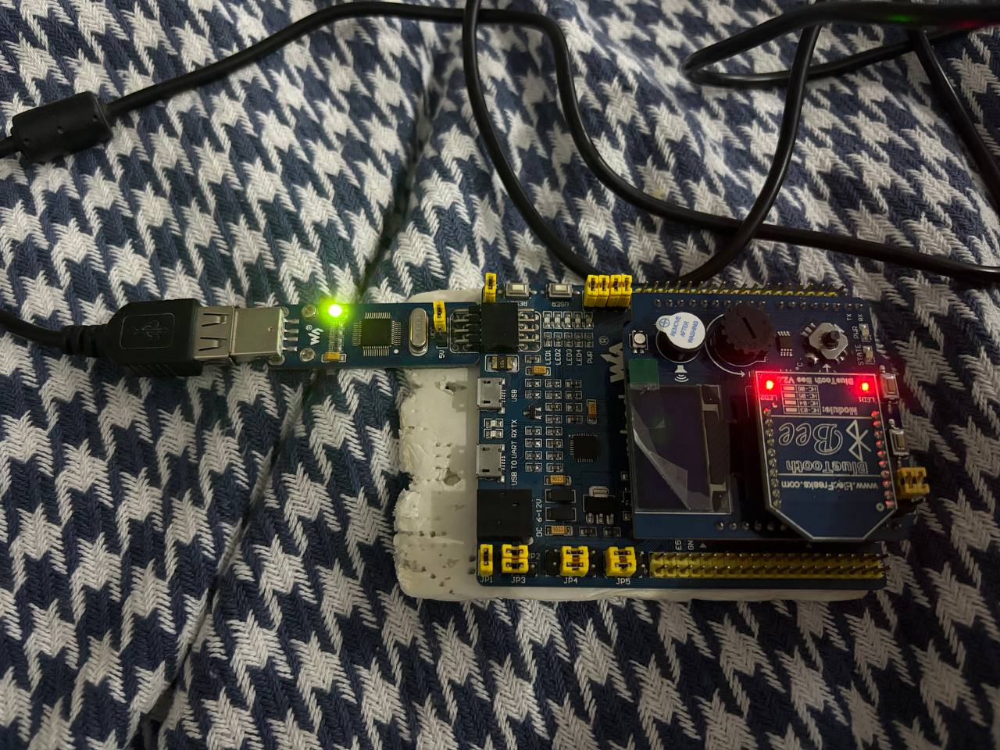
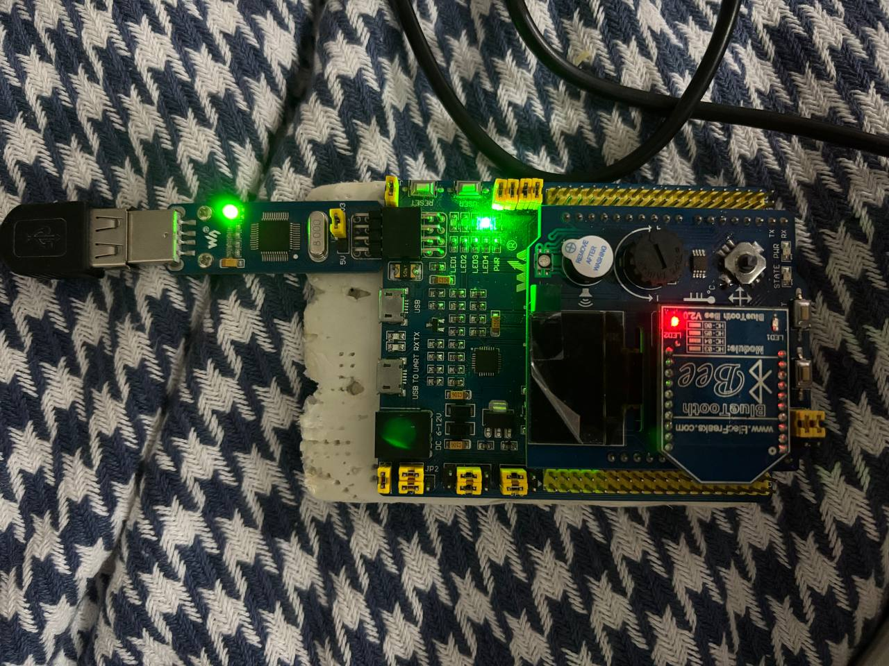

:toc:
:toc-title: ОГЛАВЛЕНИЕ

[.text-center]

= Лабораторная работа №4

[.text-center]

Типы переменных и их функции. Переключение светодиода с использованием кнопки

[.text-center]

Автор: Володина Екатерина 

[.text-center]

Группа: КЭ-413

<<<

[.text-left]

== ВВЕДЕНИЕ

В программировании переменные являются фундаментальным строительным блоком, обеспечивающим хранение и манипулирование данными в процессе выполнения программы. Однако данные, с которыми приходится работать, могут быть весьма разнообразны: от простых целых чисел и текстовых символов до сложных структур и объектов. Именно для классификации и эффективной работы с этим многообразием информации были введены *типы переменных*. Данная работа посвящена изучению различных типов переменных, их назначению, характеристикам и роли в разработке программного обеспечения, а также рассмотрению их практического применения в различных языках программирования. Понимание типов переменных является ключевым для написания корректного, эффективного и безопасного кода.

Также в данной работе мы напишем код, который реализует переключение свотодиода с использованом кнопки для нашего микроконтроллера.

<<<

[.text-left]

== Типы переменных

Типы переменных - это очень важная тема, потому что в программировании все данные - это переменные, и чтобы с ними работать, нужно понимать, какого они "вида".

*Переменная* - это такая "коробочка" с именем, куда можно положить данные. А вот что именно внутри - число, буква, текст или что-то еще, зависит от типа переменной. Тип говорит компьютеру, как именно он должен понимать и хранить эти данные.

Вот самые основные типы переменных, которые встречаются почти везде:

* *Целые числа (int)* - это просто числа без запятой: 5, -10, 1000. Если тебе нужно посчитать количество чего-то, это подойдет отлично. Компьютер хранит такие числа очень эффективно;

* *Числа с плавающей запятой (float, double)* - это числа с дробной частью, например 3.14 или -0.001. Подходят для измерений, вычислений, где важна точность с дробями;

* *Символы (char)* - это отдельные буквы, цифры или знаки, например 'A', '7', '!'. Чаще всего они хранятся в виде чисел, соответствующих символам в таблице кодов;

* *Строки (string)* - это наборы символов, то есть слова и предложения, например "привет" или "123abc". В большинстве языков программирования строка - это отдельный тип данных, который умеет хранить текст;

* *Логические переменные (bool)* — очень полезный тип, он может хранить всего два значения: истина (true) или ложь (false). Например, "включен свет?" — ответ либо да, либо нет.

Переменные - это места для хранения данных, а типы говорят компьютеру, какие данные именно лежат внутри, и что с ними можно делать.

<<<

[.text-left]

== Размеры типов данных

Размеры типов не четко определены и могут отличаться для различных микроконтроллеров. Для размеров
типов существует правило:
[.source, cpp]
----
1             <= sizeof(char)     <= sizeof(short) <= sizeof(int) <= sizeof(long)
1             <= sizeof(bool)     <= sizeof(long)
sizeof(char)  <= sizeof(long)
sizeof(float) <= sizeof(double)   <= sizeof(long double)
sizeof(T)     == sizeof(signed T) == sizeof(unsigned T)
----

Поэтому вместо прямых типов типа int, используйте псевдонимы, например:
[horizontal]
std::uint32_t:: целое беззнаковое длиной 32 бита
std::int64_t::  целое знаковое длинной 64 бита
std::uint8_t:: целое знаковое длинной 8 бит

<<<

[.text-left]

== Преобравование типов

=== Неявное преобразование типов

Базовые/простые типы неявно можно привести друг к другу. Т.е

[.source, cpp]
----
int a = 0; # <1>

char a = 512; # <2>

int a = 3.14;  # <3>

bool a = -4;  # <4>

bool a  = 0;  # <5>
----
<1> Присваимаем знаковое целое(int) число переменной целого типа;

<2> Присваиваем знаковое целое(int) число переменной типа char. Результат в а 0 ;

<3> Присваиваем число с плавающей точкой(double) к переменной типа int. Результат в а 3;

<4> Присваиваем знаковое целое(int) к переменной типа bool. Результат в а true;

<5> Присваиваем знаковое целое(int) к переменной типа bool. Результат в а false.

=== Явное преобразование типов

Так как компилятор может сделать за нас, то, что мы вообще не ожидаем, не нужно использовать неявное
преобразование типа.

Вместо этого, лучше указать компилятору явное преобразование из одного типа в другой.
В этом случае, мы говорим компилятору, что я понимаю, что я делаю, это именно так и задумано

Для преобразований из одного типа используют 4 вариантов преобразования:

* static_cast

* const_cast

* reinterpret_cast

* dynamic_cast

=== static_cast

*static_cast* позволяет сделать приведение близких типов (целые, пользовательских типов которые могут
создаваться из типов который приводится, и указатель на void* к указателю на любой тип).

Проверка производится на уровне компиляции, так что в случае ошибки сообщение будет получено в момент
сборки приложения или библиотеки.
[.source, cpp]
----
int a = static_cast<int>(0); # <1>

int a = static_cast<int>(3.14);  # <2>

bool a = static_cast<bool>(-4);  # <3>

bool a  = static_cast<bool>(0);  # <4>

float f = 3.14f ;     # <5>

float f = static_cast<float>(3.14) ;  # <6>

Complex f = static_cast<3.14> #<7>
----
[.notes]
--
<1> Явно говорим, что 0 должен восприниматься как тип (int), хотя он и так является литералом типа int;

<2> Явно говорим, что 3.14 воспринимать как int, т.е взять только целую часть;

<3> Явно говорим, -4 нужно воспринять как bool тип, в данном случае true;

<4> Явно говорим, 0 нужно воспринять как bool тип, в данном случае false;

<5> Явно говорим, что 3.14 это float;

<6> Явно говорим, что 3.14 это float;

<7> Комплексное число может создаться из double, поэтому тут будет работать static_cast.
--

=== reinterpret_cast

*reinterpret_cast* преобразует типы, несовместимыми друг с другом, и используется для:

* В свой собственный тип;

* Указателя в интегральный тип;

* Интегрального типа в указатель;

* Указателя одного типа в указатель другого типа;

* Указателя на функцию одного типа в указатель на функцию другого типа.

[.source, cpp]
----
auto ptr = reinterpret_cast<volatile uint32_t *>(0x40010000) ; # <1>
auto value = *ptr ; #<2>
----

<1> Преобразует адрес 0x40010000 в указатель типа volatile uint32_t;

<2> Записывает в переменную value (типа) значение лежащее по указателю ptr, указывающего на адрес 0x40010000.

<<<

[.text-left]

== Указатели

Представим, что переменная - это "коробочка" (как я выражалась раннее) с каким-то значением. Например, у нас есть "коробочка" с числом 10. Указатель же - это не сама "коробочка" с числом, а "записка", где написано, где именно стоит эта "коробочка". То есть указатель - это адрес этой "коробочки" в памяти компьютера.

Для чего нужны указатели:

* Иногда удобно работать не с самим значением, а с его адресом, чтобы быстро находить данные;

* С помощью указателей можно создавать сложные структуры, например списки или деревья;

* Указатели очень полезны, когда нужно передать большую переменную в функцию, чтобы не копировать её, а передать "адрес" - это экономит память и время.

В языках программирования, особенно в C и C++, указатель - это специальный тип переменной, которая хранит адрес памяти. Чтобы создать указатель, пишут звездочку (*), например:

[.source, cpp]
----
int a = 10;     // обычная переменная с числом 10
int *p = &a;    // указатель p хранит адрес переменной a
----

Знак & означает "адрес переменной". Если теперь написать *p, то мы получим значение, на которое указывает указатель (то есть 10).

Указатель можно менять, пускай он будет указывать на разные переменные. И когда мы меняем значение через указатель, меняется и сама переменная, на которую он указывает.

Важно помнить: указатели должны указывать на правильное место в памяти. Если указатель "никуда не указывает" или указывает не туда, программа может работать неправильно или даже "падать".

Указатели - это способ сказать компьютеру: "Вот где лежит нужная информация". Они - мощный инструмент, особенно в системном программировании и работе с памятью.

=== Операции над указателями

[.notes]
--
Указатели можно складывать, вычитать, сравнивать. Но указатели должны быть одного типа. Т.е. не нужно
например складывать укатель типа *char* * и *int* *
--
[source, cpp]

----
int main() {
  int  arr[] = {1,2,3,4,5} ;    # <1>
  int* ptr = arr ;              # <2>

  ptr ++ ;                      # <3>
  int a = *(ptr + 4) ;          # <4>
  if(ptr != nullptr)            # <5>
    cout << a << ": " << *ptr;  # <6>
}
----
<1> Объявление массива *arr* из 5 элементов. В целом можно считать, что массив *arr* это указатель на первый элемент массива;

<2> Обявления указателя на массив типа *int* ;

<3> Увеличиваем указатель на 1. На самом деле мы смещаемся по адресам на размер равный *size_of(int)*, т.е. на 4 байта. Т.е в данном случае указатель *ptr* стал указывать на элемент массива *arr[1]*;

<4> Объявляем переменную *а* типа *int* и присваиваем ей значение *аrr[4]*;

<5> Сравнение указателя с nullptr указателем;

<6> Вывод значения *а* и значения по адресу в указателе *ptr*. 

=== Сложение указателей

[source, cpp]

----
int main() {
  int  arr[] = {1,2,3,4,5} ;    # <1>
  int* ptr = arr ;              # <2>

  ptr ++ ;                      # <3>
  int a = *(ptr + 3) ;          # <4>
}
----

<1> Объявление массива *arr* из 5 элементов. В целом можно считать, что массив *arr* это указатель на первый элемент массива;

<2> Обявления указателя на массив типа *int*;

<3> Увеличиваем указатель на 1. На самом деле мы смещаемся по адресам на размер равный *size_of(int)*, т.е. на 4 байта. Т.е в данном случае указатель *ptr* стал указывать на элемент массива *arr[1]*;

<4> Записываем в переменную а типа int данные, находящиеся по адресу, хранящиеся в указателе ptr, смещенном на 3.
--

=== Константный указатель и указатель на константу

[source, cpp]

----
int main() {
  const auto pi[] = {3.14, 3.14159} ;
  const double *ptr = pi ;
  *ptr = 3.14159 ;                  # <1>
  ptr++ ;                           # <2>
  count << *ptr ;                   # <3>
  const double * const ptr1 = pi ;  # <4>
  ptr1++  ;                         # <5>
  retrun 0 ;
}
----
<1> Пытаемся поменять значение по указателю *ptr* (pi[0]). Ошибка, указатель на константу, нельзя
поменять значение константы;

<2> Увеличиваем указатель на 1 (теперь указатель указывает на p[1]);

<3> Вывод значения по указателю (3.14159);

<4> Объявляем константный указатель на константу;

<5> Нельзя изменить указатель, он константный.

<<<

[.text-left]

== Ссылка

[source, cpp]

----
int main(){
  int a = 0;
  int &ref = a ;                # <1>
  ref = 10;                     # <2>
  cout << &ref << ": " << ref ; # <3>
  return 0 ;
}
----
<1> Объявляем ссылку на переменную *а*;

<2> Записываем в переменную *а* число 10;

<3> Выводим адрес перменной *а* и значение переменной *a*.

*Ссылка - это псевдоним переменной.*
--
* У ссылки нельзя взять адрес. Если применить оператор взятия адреса к ней, то будет выведен адрес
переменной, на которую она ссылается;

* Ссылка ведет себя почти также как константный указатель. Её нельзя изменять, складывать, вычитать;

* Ссылки нельзя сравнивать;

* Ссылка не может быть не проинициализирована.

<<<

[.text-left]

== Регистр

Регистры - это маленькие очень быстрые «коробочки» внутри процессора. Они хранят данные, с которыми процессор работает прямо сейчас. Если представлять процессор как мозг компьютера, то регистры - это его кратковременная память.

Почему процессору нужны регистры? Потому что работать с данными в памяти (ОЗУ) медленнее, а процессор очень любит скорость. Он берет данные из регистров, делает вычисления и записывает обратно туда же. Всё происходит за доли секунды.

Вот главные особенности регистров:

* Они очень маленькие по объему - обычно могут хранить 32 или 64 бита, то есть 4 или 8 байт;

* Регистры сразу доступны процессору, что дает сверхбыструю работу;

* Их число ограничено - в разных процессорах разное количество регистров.

Виды:

* *Регистры общего назначения* - сюда помещают данные или результаты вычислений;

* 8Регистры специальных функций* - они управляют процессом работы процессора, например, текущее состояние, куда переходить дальше и т.п.

Регистры - это рабочий стол процессора, где хранятся инструменты и материалы, с которыми процессор работает прямо сейчас.

<<<

[.text-left]

== Лабораторная работа

Цель лабораторной работы: написать код для микроконтроллера, выполняющий задачу переключения светодиода с использованием кнопки.

Код:

[source, cpp]

----
#include <iostream> // for std:: cout
#include "rccregisters.hpp" // for RCC
#include "gpioaregisters.hpp" // for GPIOA
#include "gpiocregisters.hpp" // for GPIOÑ

std::uint32_t SystemCoreClock = 16'000'000U;

extern "C" {
int __low_level_init(void)
{
  //Switch on external 16 MHz oscillator
  RCC::CR::HSION::On::Set();
  while (RCC::CR::HSIRDY::NotReady::IsSet())
  {

  }
  //Switch system clock on external oscillator
  RCC::CFGR::SW::Hsi::Set();
  while (!RCC::CFGR::SWS::Hsi::IsSet())
  {

  }
  
  RCC::APB2ENR::SYSCFGEN::Enable::Set();

  return 1;
}
}

void delay(int cycles)
{
  for(int i = 0; i < cycles; ++i)    
  {
    asm volatile("");
  }    
}

int main()
{  

  //0x4002 0810
  RCC::AHB1ENR::GPIOAEN::Enable::Set() ;
  RCC::AHB1ENR::GPIOCEN::Enable::Set() ;
  GPIOA::MODER::MODER5::Output::Set() ;
  GPIOC::MODER::MODER5::Output::Set() ;
  GPIOC::MODER::MODER8::Output::Set() ;
  GPIOC::MODER::MODER9::Output::Set() ;
  bool flag = false;
  for(;;)
  {
    
   std::uint32_t* const gpiocOdrPtr = reinterpret_cast<std::uint32_t*>(0x40020814);
   std::uint32_t* const gpiocIdrPtr = reinterpret_cast<std::uint32_t*>(0x40020810);
   auto volatile idrValue= *gpiocIdrPtr;
   bool isButtonPressed = ((idrValue & (1<<13))==0);
   if (isButtonPressed)
   {
     *gpiocOdrPtr^= (1<<5);
     *gpiocIdrPtr^= (1<<5);
   }

     delay(1000000);
     
   }
  
  return 1;
}
----

До нажатия кнопки:

После нажатия кнопки:

<<<

[.text-left]

== ЗАКЛЮЧЕНИЕ

В этой работе я познакомилась с разными типами переменных и поняла, зачем они нужны в программах. На примере кнопки и светодиода я научилась включать и выключать светодиод, используя переменные для запоминания состояния и отслеживания нажатия кнопки. Эта практика помогла мне лучше понять, как работать с данными в программах и управлять простыми устройствами. Полученные навыки пригодятся мне для дальнейшего изучения программирования микроконтроллеров и создания разных проектов.  
