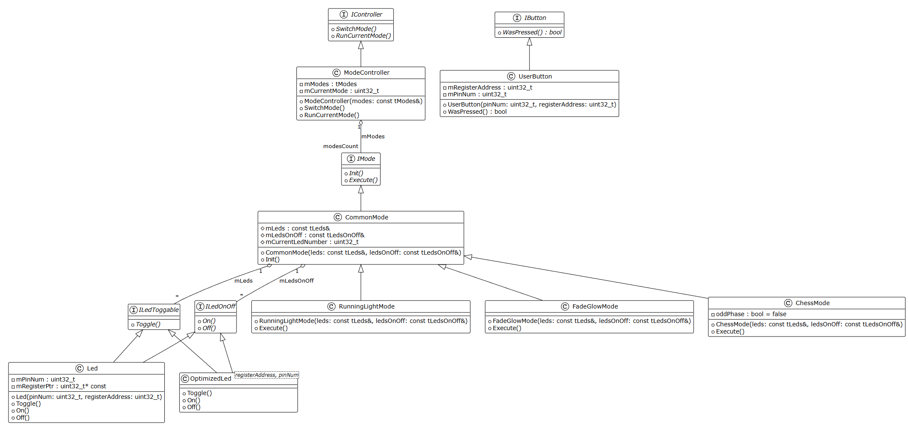

:toc:
:toc-title: ОГЛАВЛЕНИЕ

[.text-center]

= Лабораторная работа №5

[.text-center]

ПО для управления светодиодами

[.text-center]

Автор: Володина Екатерина 

[.text-center]

Группа: КЭ-413

<<<

[.text-left]

== ВВЕДЕНИЕ
В этой лабораторной, *целью* которой является создание простой программы для управления светодиода, применяя типы переменных, которые мы изучили. Наша задача - сделать так, чтобы по нажатию кнопки менялись режимы их работы. Это позволит на практике разобраться, как микроконтроллер реагирует на нажатия и управляет выводами, к которым подключены светодиоды.
Предстоит реализовать три режима:

1. Моргание - все светодиоды одновременно включаются и выключаются.

2. Бегущий огонёк - светодиоды зажигаются по очереди, будто огонёк «бежит» вдоль линии.

3. Шахматка - светодиоды делятся на чётные и нечётные: одни горят, другие в это время выключены, потом они меняются. Это самый интересный режим, требующий чуть более продуманной логики.

Выполняя работу, мы разберёмся, как обрабатывать нажатия кнопки, как управлять несколькими светодиодами и как организовать разные варианты их мигания с помощью программы.

А также отдельные классы разместить по отдельным файлам.

<<<

[.text-left]

== Код полностью

[.source, cpp]
----
#include "iostream"//for std::cout
#include "rccregisters.hpp" // for RCC
#include "gpioaregisters.hpp" // for GPIOA
#include "gpiocregisters.hpp" // for GPIOС
#include <array>// for std::array

std::uint32_t SystemCoreClock = 16'000'000U;

extern "C" {
int __low_level_init(void)
{
  //Switch on external 16 MHz oscillator
  RCC::CR::HSION::On::Set();
  while (RCC::CR::HSIRDY::NotReady::IsSet())
  {

  }
  //Switch system clock on external oscillator
  RCC::CFGR::SW::Hsi::Set();
  while (!RCC::CFGR::SWS::Hsi::IsSet())
  {

  }
  
  RCC::APB2ENR::SYSCFGEN::Enable::Set();

  return 1;
}
}

void delay(int cycles)
{
  for(int i = 0; i < cycles; ++i)    
  {
    asm volatile("");
  }    
}
///////////////////////////// ON/OFF LED /////////////////////////////
class ILedOnOff 
{
public:
  virtual void On() const = 0;
  virtual void Off() const = 0;
};

class ILedToggable
  {
  public:
    virtual void Toggle() const = 0;  //virtual method for using
  };
  

  class Led: public ILedToggable, public ILedOnOff //child class
  {
  public:
    Led(std::uint32_t pinNum, std::uint32_t registerAddress): //its own method
      mPinNum(pinNum), // number of pin
      mRegisterPtr(reinterpret_cast<std::uint32_t*>(registerAddress)) //address of pins
    {
      
    }
    void Toggle() const override 
    {
      *mRegisterPtr ^= (1 << mPinNum); //switches on and of using number of pin
    }
    void On () const override
    {
      *mRegisterPtr |= (1 << mPinNum);
    }
    void Off () const override
    {
      *mRegisterPtr &= ~(1 << mPinNum);
    }
  private:
    std::uint32_t mPinNum;
    std::uint32_t* const mRegisterPtr;
    
  };
///////////////////////// BUTTON //////////////////
class IButton
{
public:
  virtual bool WasPressed() const = 0;
};

class UserButton : public IButton
{
public:
  UserButton(std::uint32_t pinNum, std::uint32_t registerAddress):
    mPinNum(pinNum),
    mRegisterAddress(registerAddress)
    {
    
    }
  bool WasPressed() const override
  {
    bool isButtonPressed = ((*reinterpret_cast<std::uint32_t*>(mRegisterAddress) & (1 << mPinNum)) == 0);
    return isButtonPressed;
  }
private:
  std::uint32_t mRegisterAddress;
  std::uint32_t mPinNum;
};

///////////////////////////////////// MODES FOR LEDS ///////////////////////
   
class IMode
{
public:
  virtual void Init() = 0;
  virtual void Execute() = 0;
};
const auto ledsCount = static_cast<std::size_t>(4);
using tLeds = std::array<ILedToggable*, ledsCount>;
using tLedsOnOff = std::array<ILedOnOff*, ledsCount>;

class CommonMode: public IMode
{
public:
  CommonMode(const tLeds& leds, const tLedsOnOff& ledsOnOff):
    mLeds(leds),
    mLedsOnOff(ledsOnOff),
    mCurrentLedNumber(0)
    {
      
    }
    void Init() override
    {
      mCurrentLedNumber = 0;
      for (auto it: mLedsOnOff)
      {
        it->Off();
      }
    }
protected:
  const tLeds& mLeds;
  const tLedsOnOff& mLedsOnOff; 
  std::uint32_t mCurrentLedNumber;
};

class RunningLightMode : public CommonMode // MODE 1
{
public:
  RunningLightMode(const tLeds& leds, const tLedsOnOff& ledsOnOff):
    CommonMode(leds, ledsOnOff)
    {
      
    }
    void Execute() override
    {
      mLeds[mCurrentLedNumber++]->Toggle();
      if (mCurrentLedNumber == std::size(mLeds))
      {
        mCurrentLedNumber = 0;
      }
    }
};

class FadeGlowMode : public CommonMode // MODE 2
{
public:
  FadeGlowMode(const tLeds& leds, const tLedsOnOff& ledsOnOff):
CommonMode(leds, ledsOnOff)
    {
      
    }
    
    void Execute() override
    {
      for(auto it: mLeds)
      {
        mLeds[mCurrentLedNumber++]->Toggle();
        if (mCurrentLedNumber == std::size(mLeds))
        {
          mCurrentLedNumber = 0;
        }
      }
    }
};

//////////////////// Chess ////////////////////

class ChessMode : public CommonMode
{
public:
  ChessMode(const tLeds& leds, const tLedsOnOff& ledsOnOff)
      : CommonMode(leds, ledsOnOff),
        mState(false)
  {
  }

  void Init() override
  {
    mState = false;
    ApplyState();
  }

  void Execute() override
  {
    mState = !mState;  // чётные/нечётные
    ApplyState();
  }

private:
  bool mState;

  void ApplyState()
  {
    for (std::size_t i = 0; i < mLedsOnOff.size(); ++i)
    {
      bool isEven = (i % 2 == 0);

      if (isEven == mState)
        mLedsOnOff[i]->On();
      else
        mLedsOnOff[i]->Off();
    }
  }
};

////////////////////////MODE SWITCHER///////////////

class IController
{
public:
  virtual void SwitchMode() = 0;
  virtual void RunCurrentMode() = 0;
};

const std::uint32_t modesCount = 2;
using tModes = std::array<IMode*, modesCount>;

class ModeController: public IController
{
public:
  ModeController(const tModes& modes):
    mModes(modes),
    mCurrentMode(0)
    {
      
    }
    void SwitchMode() override
    {
      mCurrentMode++;
        if (mCurrentMode == std::size(mModes))
        {
          mCurrentMode = 0;
        }
        mModes[mCurrentMode]->Init();
    }
    void RunCurrentMode() override
    {
      mModes[mCurrentMode]->Execute();
    }
private:
  const tModes mModes;
  std::uint32_t mCurrentMode;
};

class TestDynamic
{
public:
  int GetI() {return i;}
private:
  int i = 0;
};

constexpr std::uint32_t buttonPinNum = 13;
constexpr std::uint32_t portCIdrAddress = 0x40020810U;
UserButton userButton(buttonPinNum, portCIdrAddress);

Led led1(5, 0x40020814U);
Led led2(8, 0x40020814U);
Led led3(9, 0x40020814U);
Led led4(5, 0x40020014U);

tLeds leds = 
{
  &led1,
  &led2,
  &led3,
  &led4
};

tLedsOnOff ledsOnOff = 
{
  &led1,
  &led2,
  &led3,
  &led4
};

RunningLightMode runningLightMode(leds, ledsOnOff);
FadeGlowMode fadeGlowMode(leds, ledsOnOff);

tModes modes
{
  &runningLightMode,
  &fadeGlowMode
};

ModeController modeController(modes);

int main()
{ 
 
  //Подать тактирование на порт А
  RCC::AHB1ENR::GPIOAEN::Enable::Set() ;
  //Подать тактирование на порт С
  RCC::AHB1ENR::GPIOCEN::Enable::Set() ;
  //Порта А.5 на вывод
  GPIOA::MODER::MODER5::Output::Set() ;
  //Порта C.5,C.8, C.9 на вывод
  GPIOC::MODER::MODER5::Output::Set() ;
  GPIOC::MODER::MODER8::Output::Set() ;
  GPIOC::MODER::MODER9::Output::Set() ;
  
  std::uint32_t currentMode = 0U;
  for(;;)
  {   
    
    if (userButton.WasPressed())
    {
        /*currentMode++;
        if (currentMode == std::size(modes))
        {
          currentMode = 0;
        }
        modes[currentMode]->Init();*/
      modeController.SwitchMode(); 
    }
    delay(500000);
    //modes[currentMode]->Execute();
    modeController.RunCurrentMode(); 
    
  
  
     //GPIOA::ODR::ODR5::High::Set();
     //GPIOC::ODR::ODR5::High::Set();
     //GPIOA::ODR::ODR5::Low::Set();
     //GPIOC::ODR::ODR5::Low::Set();

  }
  return 1;
}
----
[.notes]

<<<

[.text-left]

== Организация кода

Далее нашей задачей нужно было сделать каждый класс — в отдельных файлах:

* .h — заголовочный файл (тут описываем, что класс умеет);

* .cpp — файл реализации (тут пишем, как он это делает).

Это нужно для того, чтобы наш код был чистым.

*Интерфейсы*

ILedOnOff.h

[source, cpp]

----
#if !defined(ILEDTONOFF_H)
#define ILEDTONOFF_H
#include "ILedToggable.h"
#include <array>// for std::array
#include <cstdint>

class ILedOnOff 
{
public:
  virtual void On() const = 0;
  virtual void Off() const = 0;
};
using tLedsOnOff = std::array<ILedOnOff*, ledsCount>;
#endif // ILEDTONOFF_H
}
----

ILedToggable.h

[source, cpp]

----
#if !defined(ILEDTOGGABLE_H)
#define ILEDTOGGABLE_H
#include <array>// for std::array

class ILedToggable
{
  public:
    virtual void Toggle() const = 0;  //virtual method for using
};
const auto ledsCount = static_cast<std::size_t>(4);
using tLeds = std::array<ILedToggable*, ledsCount>;
#endif // ILEDTOGGABLE_H
----

IButton.h

[source, cpp]

----
#if !defined(IBUTTON_H)
#define IBUTTON_H

class IButton
{
public:
    virtual bool WasPressed() const = 0;
};

#endif // IBUTTON_H

----

IMode.h

[source, cpp]

----
#if !defined(IMODE_H)
#define IMODE_H

class IMode
{
public:
  virtual void Init() = 0;
  virtual void Execute() = 0;
};
#endif

----

IController.h

[source, cpp]

----
#if !defined(ICONTROLLER_H)
#define ICONTROLLER_H //for ICONTROLLER_H

class IController
{
public:
  virtual void SwitchMode() = 0;
  virtual void RunCurrentMode() = 0;
};

#endif // ICONTROLLER_H

----

*Реализация устройств*

Led.h

[source, cpp]

----
#if !defined(LED_H)
#define LED_H
#include "ILedToggable.h" // for ILedToggable
#include "ILedOnOff.h" // for ILedOnOff
#include <cstdint> // for std::uint32_t

class Led: public ILedToggable, public ILedOnOff //child class
  {
  public:
    Led(std::uint32_t pinNum, std::uint32_t registerAddress); //its own method
    void Toggle() const override; 
    void On () const override;
    void Off () const override;
  private:
    std::uint32_t mPinNum;
    std::uint32_t* const mRegisterPtr;
    
  };
  #endif // LED_H

----

Led.cpp

[source, cpp]

----
#include "Led.h"
#include <cassert>

Led::Led(std::uint32_t pinNum, std::uint32_t registerAddress): //its own method
      mPinNum(pinNum), // number of pin
      mRegisterPtr(reinterpret_cast<std::uint32_t*>(registerAddress)) //address of pins
    {
      
    }
    
    void Led::Toggle() const 
    {
      assert(mPinNum <= 15);
      *mRegisterPtr ^= (1 << mPinNum); //switches on and of using number of pin
    }
    
    void Led::On () const 
    {
      *mRegisterPtr |= (1 << mPinNum);
    }
    void Led::Off () const 
    {
      *mRegisterPtr &= ~(1 << mPinNum);
    }

----

LedConfig.h

[source, cpp]

----

#if !defined(LEDCONFIG_H)
#define LEDCONFIG_H
#include "ILedToggable.h"
#include "ILedOnOff.h" // for ILedOnOff
#include "Led.h" // for Led

const auto ledsCount = static_cast<std::size_t>(4);
using tLeds = std::array<ILedToggable*, ledsCount>;
using tLedsOnOff = std::array<ILedOnOff*, ledsCount>;

inline Led led1(5, 0x40020814U);
inline Led led2(8, 0x40020814U);
inline Led led3(9, 0x40020814U);
inline Led led4(5, 0x40020014U);

inline tLeds leds = 
{
  &led1,
  &led2,
  &led3,
  &led4
};

inline tLedsOnOff ledsOnOff = 
{
  &led1,
  &led2,
  &led3,
  &led4
};

#endif

----

UserButton.h

[source, cpp]

----
#if !defined(USERBUTTON_H)
#define USERBUTTON_H

#include "IButton.h"
#include <cstdint> // for std::uint32_t

class UserButton : public IButton
{
public:
    UserButton(std::uint32_t pinNum, std::uint32_t registerAddress);
    bool WasPressed() const override;

private:
    std::uint32_t mRegisterAddress;
    std::uint32_t mPinNum;
};

#endif // USERBUTTON_H

----

UserButton.cpp

[source, cpp]

----
#include "UserButton.h"
#include <cstdint>

UserButton::UserButton(std::uint32_t pinNum, std::uint32_t registerAddress)
    : mPinNum(pinNum)
    , mRegisterAddress(registerAddress)
{
  
}

bool UserButton::WasPressed() const
{
    bool isButtonPressed = ((*reinterpret_cast<std::uint32_t*>(mRegisterAddress) & (1U << mPinNum)) == 0);
    return isButtonPressed;
}

----

*Общий режим*

CommonMode.h

[source, cpp]

----
#if !defined(COMMONMODE_H)
#define COMMONMODE_H
#include "IMode.h" //for IMode
#include <cstdint> //for std::uint32_t
#include "ILedToggable.h" // for ILedToggable
#include "ILedOnOff.h" // for ILedOnOff

class CommonMode: public IMode
{
public:
  CommonMode(const tLeds& leds, const tLedsOnOff& ledsOnOff);
  void Init() override;
protected:
  const tLeds& mLeds;
  const tLedsOnOff& mLedsOnOff; 
  std::uint32_t mCurrentLedNumber;
};
#endif

----

CommonMode.cpp

[source, cpp]

----
#include "CommonMode.h"
#include "Led.h"
#include <cassert>
#include "ILedToggable.h" // for ILedToggable
#include "ILedOnOff.h" // for ILedOnOff

CommonMode::CommonMode(const tLeds& leds, const tLedsOnOff& ledsOnOff):
    mLeds(leds),
    mLedsOnOff(ledsOnOff),
    mCurrentLedNumber(0)
    {
      
    }
void CommonMode::Init()
    {
      mCurrentLedNumber = 0;
      for (auto it: mLedsOnOff)
      {
        it->Off();
      }
    }

----

Режим запуска Ligtmode

RunningLightMode.h

[source, cpp]

----
#if !defined(RUNNINGLIGHTMODE_H)
#define RUNNINGLIGHTMODE_H
#include "CommonMode.h"
#include "ILedToggable.h" // for ILedToggable
#include "ILedOnOff.h" // for ILedOnOff

class RunningLightMode : public CommonMode // MODE 1
{
public:
  RunningLightMode(const tLeds& leds, const tLedsOnOff& ledsOnOff);
  void Execute() override;
};

#endif
----

RunningLightMode.cpp

[source, cpp]

----
#include <cassert>
#include "RunningLightMode.h"
#include "ILedToggable.h" // for ILedToggable
#include "ILedOnOff.h" // for ILedOnOff

RunningLightMode::RunningLightMode(const tLeds& leds, const tLedsOnOff& ledsOnOff):
    CommonMode(leds, ledsOnOff)
    {
      
    }
void RunningLightMode::RunningLightMode::Execute()
    {
    mLeds[mCurrentLedNumber++]->Toggle();
    if (mCurrentLedNumber == std::size(mLeds))
    {
      mCurrentLedNumber = 0;
    }
  }
----

*Режим затухания*

FadeGlowMode.h

[source, cpp]

----
#if !defined(FADEGLOWMODE_H)
#define FADEGLOWMODE_H
#include "ILedToggable.h" // for ILedToggable
#include "ILedOnOff.h" // for ILedOnOff
#include <cstdint>
#include "IMode.h"
#include "CommonMode.h"
#include <array>// for std::array
class FadeGlowMode : public CommonMode // MODE 2
{
public:
  FadeGlowMode(const tLeds& leds, const tLedsOnOff& ledsOnOff);
    void Execute() override;
};
#endif
----

FadeGlowMode.cpp

[source, cpp]

----
#include <cstdint>
#include "FadeGlowMode.h"
FadeGlowMode::FadeGlowMode(const tLeds& leds, const tLedsOnOff& ledsOnOff):
CommonMode(leds, ledsOnOff)
    {
      
    }
    
void FadeGlowMode::Execute()
    {
      for(auto it: mLeds)
      {
        mLeds[mCurrentLedNumber++]->Toggle();
        if (mCurrentLedNumber == std::size(mLeds))
        {
          mCurrentLedNumber = 0;
        }
      }
    }
----

*Шахматный режим*

ChessMode.h

[source, cpp]

----
#if !defined(CHESSMODE_H)
#define CHESSMODE_H
#include "ILedToggable.h" // for ILedToggable
#include "ILedOnOff.h" // for ILedOnOff
#include <cstdint>
#include "IMode.h"
#include "CommonMode.h"
#include <array>// for std::array
class ChessMode : public CommonMode // MODE 3
{
public:
  ChessMode(const tLeds& leds, const tLedsOnOff& ledsOnOff);
    void Execute() override;
    
private:
    bool oddPhase = false;   // Ïåðåêëþ÷åíèå ôàç
};
#endif
----

ChessMode.cpp

[source, cpp]

----
#include <cstdint>
#include "ChessMode.h"
  ChessMode::ChessMode(const tLeds& leds, const tLedsOnOff& ledsOnOff):
CommonMode(leds, ledsOnOff)
    {
      
    }
    
/*    void ChessMode::Execute()
    {
      for(auto it: mLeds)
      {
        mLeds[mCurrentLedNumber++]->Toggle();
        if (mCurrentLedNumber == std::size(mLeds))
        {
          mCurrentLedNumber = 0;
        }
      }
    }
*/
void ChessMode::Execute()
{
   
    for (std::size_t i = 0; i < std::size(mLeds); ++i)
    {
        if ((i % 2 == 0) == oddPhase)
            mLedsOnOff[i]->On();
        else
            mLedsOnOff[i]->Off();
    }

    oddPhase = !oddPhase;
}
----

*Контроллер*

ModeController.h

[source, cpp]

----
#if !defined(MODECONTROLLER_H)
#define MODECONTROLLER_H

#include "IController.h"
#include "IMode.h"       
#include <array>         

const std::uint32_t modesCount = 3;
using tModes = std::array<IMode*, modesCount>;

class ModeController : public IController
{
public:
    ModeController(const tModes& modes);
    void SwitchMode() override;
    void RunCurrentMode() override;

private:
    const tModes mModes;
    std::uint32_t mCurrentMode;
};

#endif // MODECONTROLLER_H
----

ModeController.cpp

[source, cpp]

----
#include "ModeController.h"
#include "IMode.h"
#include <cassert>
#include "IController.h" // for IController
#include "ILedToggable.h" // for ILedToggable
#include "ILedOnOff.h" // for ILedOnOff
#include "LedConfig.h"

ModeController::ModeController(const tModes& modes):
    mModes(modes),
    mCurrentMode(0)
    {
      
    }
    void ModeController::SwitchMode() 
{
  mCurrentMode++;
    if (mCurrentMode == std::size(mModes))
    {
      mCurrentMode = 0;
    }
    mModes[mCurrentMode]->Init();
}
void ModeController::RunCurrentMode() 
{
  mModes[mCurrentMode]->Execute();
}

----

<<<

[.text-left]

== UML диаграмма 

Рисунок 1 - UML диаграмма

Диаграмма показывает систему управления режимами работы светодиодов (LED). Есть контроллер режимов, несколько режимов, кнопка, а также классы светодиодов.

*Кнопка (UserButton и IButton)*

* IButton - интерфейс, который обещает метод WasPressed() (проверка, нажата ли кнопка).

* UserButton - конкретная реализация. Она знает:
- номер пина кнопки,

- адрес регистра (где читать состояние),

- и умеет говорить, нажата ли кнопка (WasPressed()).

*Контроллер режимов (ModeController и IController)*

* IController - интерфейс с двумя функциями:

- SwitchMode() - переключить режим,

- RunCurrentMode() - выполнить текущий режим.

* ModeController - реализует этот интерфейс.

Он хранит:

- список режимов (mModes),

- текущий номер режима (mCurrentMode),

- и умеет запускать или переключать режим.

*Светодиоды (Led, OptimizedLed, ITogglable, ILedOnOff)*

* ITogglable — интерфейс с функцией Toggle() (переключить LED).

* ILedOnOff — интерфейс с методами On() и Off().

* Led — обычный светодиод:

- хранит свой пин,

- знает адрес регистра,

- может включаться, выключаться и переключаться.

* OptimizedLed — то же самое, но чуть ускоренная версия.

*Режимы работы (IMode, CommonMode и его наследники)*

IMode

Просто интерфейс с методами:

* Init()

* Execute()

CommonMode

Базовый класс для всех режимов.

Он хранит:

* список светодиодов,

* массив состояний "вкл/выкл",

* индекс текущего LED.

Все режимы наследуют поведение от него.

Конкретные режимы:

* RunningLightMode — «бегущий огонёк».

Перебирает светодиоды по очереди.

* FadeGlowMode — плавное свечение (например, ярче-тусклее).

* ChessMode — режим "шахматного поля": некоторые LED включаются через один.

Хранит флаг oddPhase, чтобы понимать, какую «полосу» включать.

<<<

[.text-left]

== Описание работы ПО

Программа управляет четырьмя светодиодами и кнопкой на микроконтроллере.

Основная идея - при нажатии кнопки переключать режимы работы светодиодов.

*1) Инициализация микроконтроллера*

После включения устройство:

а) Включает внутренний 16-МГц генератор.

б) Переключает системный такт на него.

в) Включает питание нужных портов ввода-вывода (GPIOA и GPIOC).

г) Настраивает пины:

* GPIOA5, GPIOC5, GPIOC8, GPIOC9 → выход (LED)

* GPIOC13 → вход (кнопка)

После этого микроконтроллер готов к работе: диоды можно включать/выключать, кнопку можно считывать.

*2) Управление светодиодами*

Каждый светодиод представлен классом Led, который умеет:

* On() - включить светодиод

* Off() - выключить

* Toggle() - переключить состояние

Эти методы напрямую модифицируют регистр ODR соответствующего порта.

*3) Обработка кнопки*

Кнопка - это объект класса UserButton, который:

* читает порт PC13

* возвращает true, если кнопка нажата (на плате Nucleo там активный низкий уровень)

То есть при удержании кнопки программа понимает: кнопка нажата сейчас.

*4) Режимы работы светодиодов*

Есть общий базовый класс CommonMode, от которого наследуются конкретные режимы.

Сейчас в программе 2 режима:

 а) RunningLightMode - бегущий огонь

Каждый вызов:

* переключает следующий светодиод

* цикл повторяется от 1-го до 4-го, затем сначала

По факту — классический «running light», когда свет проходит по диодам по кругу.

 б) FadeGlowMode - последовательное мигание всех

В этом режиме:

* программа последовательно делает Toggle() всех диодов

* каждый проход сдвигает активный светодиод на один

Выглядит как более «быстрое» вращение.

*5) Переключатель режимов*

Режимами управляет объект ModeController.
Он содержит массив всех режимов и номер текущего режима.

При нажатии кнопки вызывается:

[source, cpp]

----

modeController.SwitchMode();

----

Он:

a) увеличивает номер режима

б) если дошли до конца - начинает снова с 0

в) вызывает Init() для нового режима

Каждый цикл в main вызывается:

[source, cpp]

----

modeController.RunCurrentMode();

----

То есть устройство постоянно выполняет текущий режим.

*6) Главный цикл (mane)*

Простой бесконечный цикл:

а) Если кнопка нажата -> переключить режим

б) Подождать примерно 0,5 млн циклов (примитивная задержка)

в) Выполнить текущий режим

Таким образом:

* кнопкой мы меняем поведение светодиодов

* светодиоды работают без остановки, пока устройство включено

<<<

[.text-left]

== Выбор интерфейсов

В коде есть три ключевых интерфейса:

1) ILedOnOff / ILedToggable (интерфейсы светодиода)

Мы хотели отделить конкретный способ управления выводами микроконтроллера от логики режимов.

Режимам вообще не важно, какой там регистр и какой у него адрес - им нужно только «включить LED», «выключить LED» или «переключить LED».

Поэтому мы формализовали поведение:

* ILedOnOff - если режиму нужна работа напрямую (On/Off).

* ILedToggable - если режиму нужно просто щёлкать состояние.

Зачем два интерфейса, а не один?

Потому что не каждый режим обязан уметь всё. Например, некоторые режимы используют только Toggle - им не нужен доступ к On/Off.

То есть интерфейсы позволяют:

* писать режимы, не зная ничего о том, как устроена плата;

* подменять светодиоды на мок-объекты при тестировании;

* держать код чистым и гибким.

2) IButton (интерфейс кнопки)

Режимы и контроллеру всё равно, где физически находится кнопка и что там за порт.

Им нужна одна операция — WasPressed.

Это позволило:

* легко подменять кнопку на любую другую реализацию (другой порт, инверсная логика, обработка дребезга);

* не засорять основную логику деталями железа.

3) IMode (интерфейс режима)

Каждый режим обязан уметь:

* Init() — подготовить свои данные;

* Execute() — один шаг работы.

Именно такие методы выбраны, потому что режимы периодические:
на каждом шаге они делают небольшой кусок поведения.

<<<

[.text-left]

== Определение абстракций 

Основной сложностью было разделить код на уровни так, чтобы:

* логика работы светодиодов не зависела от железа;

* логика режимов не зависела ни от светодиодов, ни от кнопки;

* контроллер режимов не зависел от того, что именно режимы делают;

* main() был как можно проще.

Чтобы этого добиться, мы выделили несколько уровней:

1) Уровень железа

Класс Led и UserButton.

Они знают, какие регистры трогать, и только они.

2) Уровень абстракции устройств

Интерфейсы ILedOnOff, ILedToggable, IButton.

Режимы работают уже через них - без привязки к регистрам.

3) Уровень поведения

IMode и конкретные режимы (RunningLight, FadeGlow и т.д.).
Каждый режим — это «правило», по которому меняются светодиоды.
4. Уровень управления
ModeController.
Меняет режимы и передаёт управление текущему.
Такой разрез не появился сразу — приходилось искать границы ответственности и убирать лишний «бетон» (жёсткие привязки к регистрами). Несколько раз всё перекраивалось, пока не получилась структура, которую удобно расширять и поддерживать.

<<<

[.text-left]

== ЗАКЛЮЧЕНИЕ

В этой работе мы на практике разобрались, как микроконтроллер управляет светодиодами и реагирует на нажатие кнопки. Было создано три режима: обычное моргание, «бегущий огонёк» и «шахматка». Каждый режим получился со своим характером, и все они переключаются одной кнопкой.

Чтобы программа была понятной и удобной, мы разделили её на отдельные классы и разнесли их по разным файлам. Благодаря этому код стал аккуратным и его проще дополнять новыми режимами или менять существующие.

В итоге мы не только реализовали все требуемые эффекты, но и получили хороший опыт работы с абстракциями, объектами и структурированием проекта для микроконтроллера.

